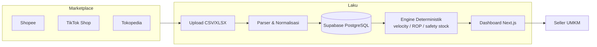

# Laku — Demand-Driven Restock Engine

<div align="center">

**"Tau apa yang bakal laku, sebelum stokmu habis."**
*Restock Engine & Inventory Intelligence untuk Seller Multi-Marketplace (Shopee, TikTok Shop, Tokopedia)*

[](https://laku.muaraai.com)
[](https://api.muaraai.com/v1/laku/health)
[](https://github.com/MuaraAI/laku/actions)
[](LICENSE)
[](https://laku.muaraai.com)

[**Buka Aplikasi Live**](https://laku.muaraai.com) • [**Coba Dashboard Demo**](https://laku.muaraai.com/dashboard) • [**Telemetri Real-Time API**](https://api.muaraai.com/v1/laku/v1/stats) • [**Status Kesehatan API**](https://api.muaraai.com/v1/laku/health)

</div>

---

## Tentang Laku

Laku adalah restock engine untuk seller UMKM yang jualan di lebih dari satu marketplace sekaligus (pilot: Pontianak, Kalimantan Barat). Cukup unggah file export CSV atau XLSX dari Seller Center, sistem langsung merapikan semua transaksi ke satu database, menghitung laju penjualan, lalu memberi rekomendasi restock yang bisa dipercaya.

Karya ini diajukan untuk **Digital Innovation Challenge SIFEST 2026** — Track Digital Economy, oleh tim **MuaraAI** (Universitas Bina Sarana Informatika Pontianak).

### Masalah yang Diselesaikan

1. **Buta stok lintas channel.** Stok gudang bisa habis di satu channel saat channel lain tiba-tiba ramai, karena seller tidak punya data gabungan.
2. **Modal kerja macet di stok mati.** Restock tanpa hitungan membuat uang tertimbun di barang yang lambat laku.
3. **Rekap manual makan waktu.** Seller menghabiskan 3–5 jam per minggu mencocokkan export spreadsheet yang formatnya berbeda-beda.

### Cara Kerja Singkat

1. Seller mengunggah file export penjualan (CSV/XLSX) dari masing-masing marketplace.
2. Parser merapikan semua transaksi ke satu database. Data duplikat otomatis dikenali dan tidak dihitung dua kali.
3. Engine menghitung laju penjualan riil (*velocity*), Reorder Point (ROP), dan Safety Stock (SS) memakai formula Silver-Peterson.
4. Dashboard menampilkan rekomendasi jelas: apa yang harus dipesan, berapa banyak, dan apa yang sebaiknya berhenti dibeli.

---

## Arsitektur Sistem



Prinsip penting: seluruh angka bisnis dihitung formula matematika, bukan AI. AI hanya dipakai di fase terbatas (tool-use), sehingga tidak ada risiko angka karangan.

### Pilar Utama

1. **100% deterministik.** Semua rekomendasi dihitung formula Silver-Peterson EOQ/ROP (§9A PRD) dan rekap alokasi voucher pro-rata (§9D PRD). Bukan wrapper ChatGPT.
2. **Privasi pembeli terjaga (UU PDP No. 27/2022).** Nama, nomor telepon, dan alamat mentah dibuang saat parsing dan tidak pernah disimpan di database, log, maupun laporan error. Hanya agregasi wilayah yang disimpan.
3. **Dedup idempoten lintas marketplace.** Kunci unik 6 kolom: `seller_id + source_system + sales_channel + shop_id + order_id + line_key`. File yang diunggah ulang tidak akan menduplikasi transaksi.
4. **Dashboard dua mode.** Mode Demo bisa langsung dieksplorasi tanpa login (10 SKU contoh). Mode Toko Saya terhubung ke database asli via JWT Supabase dengan wizard onboarding.
5. **Autentikasi fleksibel.** Google OAuth 2.0 atau email magic link (OTP 6 digit). Akun baru otomatis mendapat workspace toko lewat trigger database.

### Struktur Repositori

```
laku/
├── app/                        # Next.js 15 App Router (Frontend Web & Dashboard)
│   ├── (marketing)/            # Landing page, Syarat & Ketentuan, Kebijakan Privasi
│   ├── (auth)/                 # Halaman Login (Google OAuth & Magic Link)
│   ├── (dashboard)/            # Dashboard terintegrasi (/dashboard)
│   └── auth/callback/          # Handler OAuth & OTP
├── components/                 # Komponen UI (Landing, Dashboard, Auth)
├── constants/id.ts             # Sumber teks UI Bahasa Indonesia terpusat
├── backend/                    # Core Engine Service (FastAPI)
│   ├── app/routers/            # Endpoint: /imports, /recommendations, /stock, /recap, /me, /stats
│   ├── app/services/           # Engine §9A, Recap §9D, Ledger, Parser marketplace
│   ├── app/middleware/         # Rate limiting token bucket
│   ├── configs/channels/       # Pemetaan kolom marketplace (YAML)
│   ├── supabase/migrations/    # Skema SQL + RLS policies + RPC
│   └── tests/                  # Test suite pytest (174 tests)
├── DESIGN.md                   # Spesifikasi Design System (Ledger Rail)
└── docs/                       # Materi proposal & submission SIFEST 2026
```

### Stack Teknologi

| Komponen | Teknologi | Deployment |
|---|---|---|
| Frontend Web | Next.js 15 (App Router), TypeScript, Tailwind v4 | Vercel — laku.muaraai.com |
| Backend API | Python 3.12, FastAPI, Pydantic v2 | VPS, PM2, Caddy Reverse Proxy |
| Database | Supabase PostgreSQL 17 + Row Level Security | Supabase Cloud (Singapore) |
| Auth | Supabase Auth (Google OAuth + Magic Link SMTP) | support@laku.muaraai.com |
| Cache & Task | Redis (database terisolasi) | VPS Linux |
| Testing | Pytest, AnyIO, Vitest | GitHub Actions CI |

---

## Panduan Instalasi Lokal

Prasyarat: Node.js >= 20, Python >= 3.12, Git.

```bash
git clone https://github.com/MuaraAI/laku.git
cd laku
```

Frontend (Next.js):

```bash
npm install
cp .env.example .env.local
# Isi NEXT_PUBLIC_SUPABASE_URL, NEXT_PUBLIC_SUPABASE_ANON_KEY, NEXT_PUBLIC_API_BASE_URL
npm run dev
```

Buka `http://localhost:3000`.

Backend (FastAPI):

```bash
cd backend
python -m venv .venv
source .venv/bin/activate   # Windows: .venv\Scripts\activate
pip install -r requirements.txt
cp ../.env.example .env
uvicorn app.main:app --reload --port 8400
```

API aktif di `http://127.0.0.1:8400`, cek kesehatan di `/health`.

---

## Pengujian

Disiplin test berfokus pada perilaku eksternal: parser fixtures, dedup idempoten, engine golden test, RLS isolation, dan role guard.

```bash
# Seluruh test suite backend (174 tests)
cd backend && pytest tests/ -v

# Build & lint frontend
npm run lint
npm run build
```

Semua commit di branch `main` wajib lulus pemeriksaan otomatis GitHub Actions CI.

---

## Tim Pengembang (MuaraAI)

| Anggota | GitHub | Peran | Fokus Utama | Commit |
|---|---|---|---|---|
| **Yuken Velino** | [@Curzyori](https://github.com/Curzyori) | Kapten Tim / Founder & Lead Backend | Arsitektur sistem, Core Engine deterministik §9A, code review & penguatan kualitas kode | 82 |
| **Muhammad Raffli Aldiansyah** (Bob) | [@Seeyaa77](https://github.com/Seeyaa77) | Backend & Security Engineer | Audit keamanan, parser export marketplace, deduplikasi data, infrastruktur VPS Linux | 5 |
| **Jio** | [@MyKineID](https://github.com/MyKineID) | Lead Frontend & UI/UX Engineer | Desain antarmuka, motion interaction, landing page, sistem semantic & aksesibilitas web (WCAG) | 14 |
| **Raken** | [@kabayy-sys](https://github.com/kabayy-sys) | Product & Business Lead | Inisiator ide proyek, riset model bisnis UMKM, prototype dashboard, koordinator video demo & proposal | 3 |

*Jumlah commit dihitung per 7 Oktober 2026.*

**Institusi:** Universitas Bina Sarana Informatika (UBSI) Kampus Kota Pontianak.

---

## Kontak & Dukungan

- **Email Resmi:** [support@laku.muaraai.com](mailto:support@laku.muaraai.com)
- **Alamat / Domisili:** Pontianak, Kalimantan Barat, Indonesia
- **Komunitas:** [MuaraAI GitHub](https://github.com/MuaraAI)

---

## Lisensi

Proyek ini dilisensikan di bawah lisensi **Apache-2.0** — lihat berkas [LICENSE](LICENSE).
Nama *"Laku"* dan logo *MuaraAI* adalah merek dagang milik MuaraAI (lihat [NOTICE](NOTICE)).
