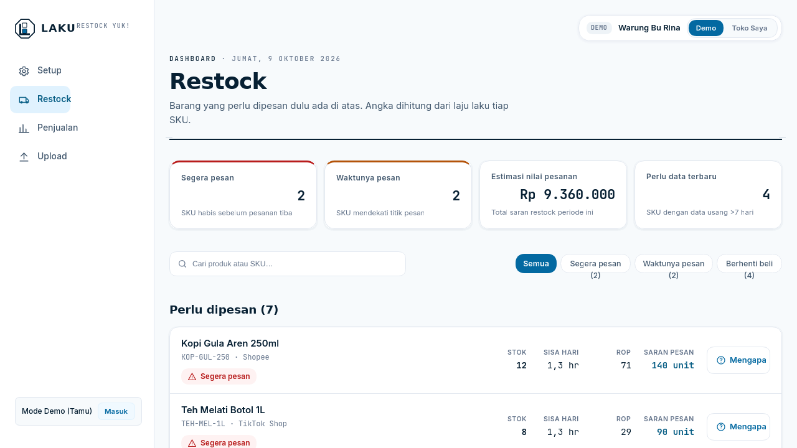
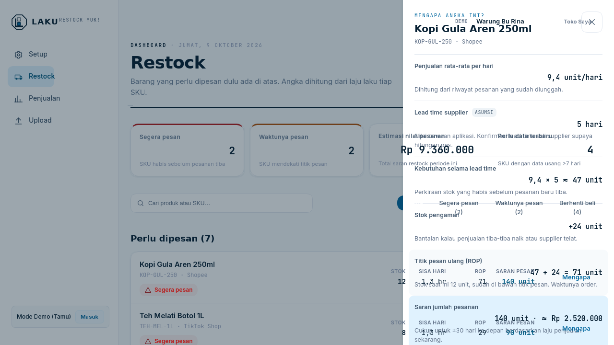
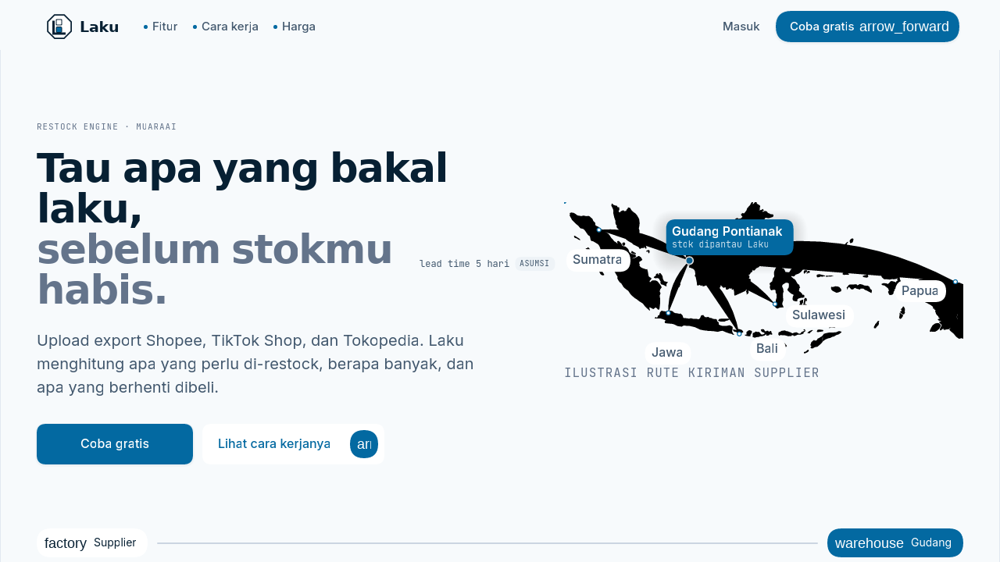
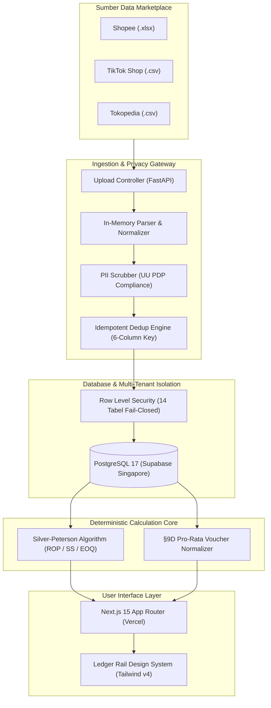

# Laku — Demand-Driven Restock Engine

<div align="center">

**"Tau apa yang bakal laku, sebelum stokmu habis."**  
*Demand-Driven Restock Engine untuk Seller Multi-Marketplace (Shopee, TikTok Shop, Tokopedia)*

[](https://github.com/MuaraAI/laku/actions)
[](https://github.com/MuaraAI/laku/actions)
[](LICENSE)
[](https://laku.muaraai.com)

[](https://laku.muaraai.com)
[](https://laku.muaraai.com/dashboard)
[](https://api.muaraai.com/v1/laku/v1/stats)

<br/>



*Antarmuka Dashboard Laku — Perhitungan otomatis Reorder Point (ROP), Laju Penjualan Harian, dan Status Restock Kritis secara Real-Time.*

</div>

---

## 👥 Tim Pengembang (MuaraAI)

Karya inovasi digital ini dikembangkan secara kolaboratif oleh mahasiswa **Universitas Bina Sarana Informatika (UBSI) Kampus Kota Pontianak** untuk kompetisi **Digital Innovation Challenge SIFEST 2026 (Track Digital Economy)**:

<div align="center">

| | |
|:---:|:---:|
| [](https://github.com/Curzyori) | [](https://github.com/MyKineID) |
| **[Yuken Velino](https://github.com/Curzyori)** — Kapten Tim / Lead Tech | **[Jioo](https://github.com/MyKineID)** — Lead Frontend & UI/UX |
| Arsitektur full-stack, core deterministic engine, skema PostgreSQL RLS | Arsitektur Next.js 15 App Router, UI/UX Ledger Rail, aksesibilitas WCAG |
| [](https://github.com/Seeyaa77) | [](https://github.com/kabayy-sys) |
| **[Muhammad Raffli Aldiansyah (Bob)](https://github.com/Seeyaa77)** — Backend & Security | **[Raken](https://github.com/kabayy-sys)** — Product & Business (Hustler) |
| Audit pentest security, rate limiting token bucket, server VPS & deploy | Validasi lapangan UMKM Pontianak, proposal proyek, produksi video demo |

*120 commit terverifikasi di branch `main` sejak rilis awal 5 Oktober 2026.*

</div>

---

## 🎯 Latar Belakang & Validasi Masalah

Sebagian besar pelaku UMKM retail di Indonesia mengelola operasional multi-channel secara terpisah. Berdasarkan validasi lapangan pada seller percontohan di Pontianak, Kalimantan Barat (studi kasus: Warung Bu Rina & seller retail lokal):

1. **Blind Stockout Lintas Channel:**  
   Stok gudang fisik habis di Shopee karena terjadi lonjakan pesanan mendadak di TikTok Shop, berujung pada pembatalan pesanan sepihak dan penalti reputasi toko.
2. **Modal Kas Macet di Stok Mati (*Dead Stock*):**  
   Restock tanpa data menyebabkan 20–35% modal kerja tertimbun di SKU barang yang perputarannya lambat (*overstock*), sementara barang laris kehabisan persediaan (*stockout*).
3. **Beban Rekapitulasi Manual (3–5 Jam/Minggu):**  
   Pedagang menghabiskan waktu berjam-jam mencocokkan format spreadsheet ekspor Shopee, TikTok Shop, dan Tokopedia yang saling berbeda struktur kolom dan zona waktunya.

---

## 🚀 Solusi: Laku Restock Engine

Laku mentransformasi file laporan penjualan (CSV/XLSX) yang sudah diunduh seller menjadi keputusan restock yang terukur, akuntabel, dan instan:

1. **Normalisasi Multi-Channel Otomatis:** Parsing cerdas yang memetakan format Shopee, TikTok Shop, dan Tokopedia ke skema kanonikal tunggal berzona waktu WIB (`Asia/Jakarta`).
2. **Deterministic Calculation Core (Silver-Peterson):** Formula inventori matematis lokal yang menghitung laju penjualan ($\mu$), varians demand ($\sigma$), Safety Stock ($SS$), dan Reorder Point ($ROP$) tanpa halusinasi AI.
3. **Panel Transparansi "Mengapa Angka Ini?":** Setiap rekomendasi pembelian dapat diaudit perhitungannya oleh pedagang sampai ke rumus dasarnya.

<div align="center">



*Panel Audit Formula — Setiap angka rekomendasi restock transparan dan dapat diverifikasi oleh seller.*

</div>

---

## 💡 Filosofi Desain & Keputusan Rekayasa

### 1. Mengapa Deterministik Murni (Bukan Wrapper LLM)?
Dalam manajemen keuangan dan logistik inventori, **salah hitung 1 unit berarti kerugian nyata bagi seller**. Menyerahkan angka saldo persediaan kepada LLM probabilistik membawa risiko fatal halusinasi. Oleh karena itu:
- **Core Engine (100% Deterministik):** Formula matematis baku Silver-Peterson (1980) menjamin hasil yang konsisten, akurat, dan dapat diaudit.
- **AI (Muara V1 Flash - Phase B):** Diposisikan secara ketat sebagai *Strategic Narrative Advisor* untuk menerjemahkan tren sentimen pasar dan rekomendasi naratif — AI tidak pernah menulis atau memodifikasi nilai transaksi.

### 2. Mengapa Upload File Ekspor (Bukan API Berbayar)?
*Meets sellers where they are.* Mengintegrasikan API resmi marketplace (Shopee Open Platform, TikTok Shop Partner, Tokopedia Developer) membutuhkan badan hukum PT/CV, persetujuan berbelit, dan biaya lisensi tinggi yang mustahil dipenuhi oleh 90% pelaku UMKM mikro. Fitur ekspor laporan penjualan CSV/XLSX tersedia gratis untuk seluruh seller sejak hari pertama.

### 3. Kepatuhan UU PDP No. 27/2022 (*Privacy by Design*)
Data pembeli (nama lengkap, nomor telepon `08xx`, dan alamat jalan mentah) **dibersihkan dan dibuang di memori (*in-memory*) saat parsing**. Sistem hanya menyimpan agregasi tingkat kabupaten/kota dan provinsi untuk analisis geografis sebaran pesanan. Tidak ada PII pembeli yang tersimpan di database maupun disk.

<div align="center">



*Visualisasi Rute Logistik Nasional & Pemantauan Gudang Lokal Pontianak.*

</div>

---

## 🏗️ Arsitektur & Keamanan Sistem



### Pilar Keamanan:
- **PostgreSQL Row Level Security (RLS):** Seluruh 14 tabel database membatasi akses berbasis `app.seller_id` (`SECURITY DEFINER`), memastikan isolasi data antar toko kedap 100%.
- **Role-Based Financial Guard:** Endpoint rekapitulasi keuangan (`/v1/recap`) mewajibkan guard `require_owner` (Operator menerima HTTP 403 Forbidden).
- **Anti-Spoof Rate Limiting:** Token-bucket rate limiter dengan prioritas header `CF-Connecting-IP` Cloudflare untuk mencegah serangan rotasi IP di balik proxy.

---

## 📂 Struktur Repositori

```
laku/
├── app/                        # Next.js 15 App Router (Web & Dashboard)
│   ├── (marketing)/            # Landing page, Syarat & Ketentuan, Kebijakan Privasi
│   ├── (auth)/                 # Halaman Login (Google OAuth & Magic Link)
│   ├── (dashboard)/            # Dashboard terintegrasi (/dashboard)
│   └── auth/callback/          # Handler OAuth & OTP
├── components/                 # Komponen UI (Landing, Dashboard, Auth)
├── constants/id.ts             # Sumber teks UI Bahasa Indonesia terpusat
├── backend/                    # Core Engine Service (FastAPI)
│   ├── app/routers/            # Endpoint: /imports, /recommendations, /stock, /recap, /me, /stats
│   ├── app/services/           # Engine perhitungan, recap, ledger, parser marketplace
│   ├── app/middleware/         # Rate limiting token bucket (CF-Connecting-IP)
│   ├── configs/channels/       # Pemetaan kolom marketplace (YAML)
│   ├── supabase/migrations/    # Skema SQL + RLS policies + RPC
│   └── tests/                  # Test suite pytest (193 tests passed)
├── DESIGN.md                   # Spesifikasi Design System (Ledger Rail)
└── docs/                       # Berkas proposal resmi SIFEST 2026 (MuaraAI_Laku_ProposalRingkas.pdf)
```

---

## ⚙️ Panduan Menjalankan Sistem Secara Lokal

Prasyarat: Node.js >= 20, Python >= 3.12, Git.

```bash
git clone https://github.com/MuaraAI/laku.git
cd laku
```

### 1. Frontend (Next.js 15)
```bash
npm install
cp .env.example .env.local
npm run dev
```
Buka `http://localhost:3000` di peramban.

### 2. Backend (FastAPI)
```bash
cd backend
python -m venv .venv
source .venv/bin/activate   # Windows: .venv\Scripts\activate
pip install -r requirements.txt
cp ../.env.example .env
uvicorn app.main:app --reload --port 8400
```
API aktif di `http://127.0.0.1:8400`, verifikasi kesehatan di `/health`.

---

## 🧪 Pengujian Kualitas (Quality Assurance)

Pengujian mencakup pengujian perilaku eksternal: parser fixtures, dedup idempoten, engine golden test, isolasi RLS, dan rate limiting:

```bash
# Seluruh test suite backend (193 tests)
cd backend && pytest tests/ -v

# Pemeriksaan linter dan build produksi frontend
npm run lint
npm run build
```

Semua commit di branch `main` wajib lulus verifikasi otomatis GitHub Actions CI (Backend Test Suite + Frontend Quality & Build).

---

## 📄 Berkas Submission & Tautan Terkait

- **Berkas Proposal Resmi SIFEST 2026:** [`docs/MuaraAI_Laku_ProposalRingkas.pdf`](docs/MuaraAI_Laku_ProposalRingkas.pdf)
- **Aplikasi Web Live:** [https://laku.muaraai.com](https://laku.muaraai.com)
- **Demo Interaktif Langsung:** [https://laku.muaraai.com/dashboard](https://laku.muaraai.com/dashboard)
- **Endpoint Telemetri Live:** [https://api.muaraai.com/v1/laku/v1/stats](https://api.muaraai.com/v1/laku/v1/stats)
- **Email Kontak:** [support@laku.muaraai.com](mailto:support@laku.muaraai.com)

---

## 📜 Lisensi & Merek Dagang

Proyek ini dilisensikan di bawah lisensi **Apache-2.0** — lihat berkas [LICENSE](LICENSE).  
Nama *"Laku"* dan logo *MuaraAI* adalah merek dagang milik MuaraAI (lihat [NOTICE](NOTICE)).
