# PRD v3.1: Laku — Demand-Driven Regional Restock Engine + Consolidated Sales View

- Date: 2026-10-04 (v3.0 audit pass §0.1d; v3.1 external-review pass §0.1e, same day)
- Status: **APPROVED v3.1** — A1–A16 confirmed by Yuken (2026-10-04); ready for `superpowers:writing-plans`
- Author: Yuken Velino (MuaraAI Team) — synthesized from 2-day brainstorming (2026-10-03/04) + review pass
- Context: SIFEST 2026 Digital Innovation Challenge (Universitas Harkat Negeri) — Track **Digital Economy**
- Product naming: **FINAL — "Laku"** (`laku.muaraai.com`, DNS free-checked 2026-10-04). "Laku" = bahasa jualan sehari-hari untuk "terjual"; menutup seluruh fitur (yang laku, biar laku, yang gak laku). Tagline kerja: "MuaraAI Laku — Tau apa yang bakal laku, sebelum stokmu habis." Not affiliated with, or endorsed by, Shopee, TikTok Shop, or Tokopedia (disclaimer on landing, TOS, footer).

---

## 0. What changed from v1 (and what needs your confirmation)

### 0.1 Changelog v1 → v2

| # | Change | Why (review finding) |
|---|---|---|
| 1 | New **Engine Specification** (§9A): inputs, formulas, states, worked example | v1 had no source for stock/lead time; formulas undefined |
| 2 | New **stock baseline & lead-time inputs** (FR-26) and stock ledger promoted to P0 (FR-11) | Restock qty cannot be computed from sales alone |
| 3 | **Dedup key fixed** to line-item level + status upsert (FR-3, FR-27) | `(order_id, channel)` collapses multi-item orders; statuses change between exports |
| 4 | **Order status handling** (cancelled/returned/unpaid excluded) (FR-27) | Cancelled orders inflate demand |
| 5 | **Overstock / dead-stock detection** (FR-28) | v1 problem statement named dead stock but no FR solved it |
| 6 | **PII minimization at ingest** + sanitized LLM input (FR-29, FR-20) | Marketplace exports contain buyer name/phone/address; UU PDP |
| 7 | **XLSX support**, encoding/delimiter detection, format-registry task tonight (FR-1, §11) | Seller Center exports are often .xlsx; fixtures were guesses |
| 8 | **Onboarding wizard + per-channel export guides** (FR-30) | Persona is low-tech; import is the hardest step |
| 9 | **Scope re-cut**: Operator role, PWA, review-queue UI, savings estimate → P1; Phase B committed set reduced | 15 P0s for 4 people in ~3.5 days was not feasible |
| 10 | **Security model clarified**: repository-level seller scoping + RLS defense-in-depth; `seller_members` table | Service key bypasses RLS; operator↔seller link was missing |
| 11 | **Insights privacy hardened**: k≥3 AND min orders AND dominance rule AND roll-up; sanitized tool output | k-anonymity alone is insufficient; cross-tenant prompt-injection vector |
| 12 | **AI numbers rendered from tool JSON by the UI**; narrative numeric-check | "LLM never fabricates" must be enforced, not assumed |
| 13 | **AI memory redesigned** (Postgres source of truth, lazy + periodic summarization) | v1 sliding-TTL trigger lost most memories |
| 14 | **Quota made atomic** (Lua) | `INCR` + `EXPIRE` race can leave key without TTL |
| 15 | New sections: **competitive landscape**, **business model hypotheses**, **ops & demo-safety**, **ownership** | Missing in v1 |
| 16 | **Success metrics rewritten**: backtest + real-seller validation instead of self-made seed match rate | v1 metrics were circular |
| 17 | **Timeline re-planned** from now (Sun Oct 4, 21:00 WIB) with buffer before the Oct 8 deadline | v1 Day 1 was already mostly gone; Day 5 = deadline |
| 18 | **Acceptance criteria** for every P0 FR; inconsistencies fixed (FR-5/FR-19, FR-8/FR-11) | v1 gaps |

### 0.1b Changelog v2 → v2.1

| # | Change | Why |
|---|---|---|
| 19 | New **Consolidated Sales Recap** (FR-39, P0-lite; spec §9D): gross sales, returns, discounts, **net sales** merged across Shopee/TikTok Shop/Tokopedia, split per channel and per period | Sellers want one omzet view across platforms; the data already exists in `order_lines`, so cost is low and it gives a reason to open the app weekly |
| 20 | Positioning clarified (§1, §2.1): Laku = **unified view + restock decision layer** on top of the marketplaces, which remain the source of truth | Consolidated reporting is table stakes in omnichannel tools; restock decisions stay the differentiator |
| 21 | **Data-coverage banner + metric definitions** on every sales number | Totals from partial uploads mislead; numbers will differ from Seller Center and must be explainable |
| 22 | P1 additions: **settlement/income report import** for net income after platform fees (FR-40) and **gross profit** from cost price (FR-41) | Fees live in separate marketplace reports (to verify); profit needs `cost_price` |
| 23 | `get_sales_summary` advisor tool (owner-only); Operator has no access to any sales/revenue view | Consistency with the anti-wrapper guarantee and role rules |

### 0.1c Changelog v2.1 → v2.2

| # | Change | Why |
|---|---|---|
| 24 | New **Appendix B — Diagrams & Flowcharts** (14 figures in Mermaid): architecture, import flow, product matching, engine decision flow, stock position, sales recap metrics, onboarding, restock loop, ERD, roles and access, AI advisor sequence, AI memory, insights publication rule, timeline | Make the mechanisms readable at a glance for the team, the proposal and the demo; Mermaid renders natively on GitHub |
| 25 | **Spec fix (§9A, FR-28):** `DEAD` now requires at least 60 days of history, and is evaluated before `INSUFFICIENT_DATA` | Found while drawing Fig. 4: a brand-new product with no sales would have been labeled dead |
| 26 | **Section order fixed:** §9D (Sales Recap Specification) now follows §9C | v2.1 placed it before §9B |
| 27 | Cross-references to the figures added in §7, §9, §9A and §9D | Navigation |

### 0.1d Changelog v2.2 → v3.0 (audit pass)

| # | Change | Why |
|---|---|---|
| 28 | **Engine:** weekly review interval `R`; protection interval `P = LT + R`; golden example recomputed (SS 23 · ROP 143 · qty 173) (§9A) | v2.2 used a continuous-review reorder point although data arrives weekly |
| 29 | **States:** `OVERSTOCK` evaluated before `INSUFFICIENT_DATA` (needs ≥30 days of history); `history` defined once; `STALE` and `NEGATIVE` overlays (FR-43) | Slow items never reached "stop buying"; stale uploads silently skewed `on_hand` |
| 30 | **Stock template** creates products that never sold (FR-26); marketplace product/stock export import = P1 (A10) | Dead stock was undetectable if the product never appears in sales files |
| 31 | Default lead time carries an **"asumsi" badge** and is confirmed in onboarding | "No fabricated numbers" must also hold for defaults |
| 32 | **ADR-2: no raw file at rest** — parse in memory, sanitized staging only; FR-29 reworded | v2.2 kept the raw PII file in Storage until confirm/24h |
| 33 | **ADR-1: tenant isolation** — non-bypass DB role + `SET LOCAL` seller scope so RLS is actually evaluated | A service key bypasses RLS, so "defense-in-depth" was decorative |
| 34 | **Insights:** closed category taxonomy, cell = region × category, ranks + coarse share, fixed 28-day window (FR-19, A12) | Region-only rule leaks niche categories; no category source existed; free text was an injection vector |
| 35 | **Sales recap:** `price_basis`, order-level voucher allocation, `sold_at` semantics, `data_from` + gap detection, staleness by import date, "sementara" chip, profit labeled "before platform costs" (§9D) | Double-counting and partial-coverage risks |
| 36 | **Metrics:** North Star, backtest replaced by policy replay, match-precision sample ≥60, FR-30 test protocol, data-health metrics (§8) | Backtest was near-circular; several KPIs unmeasurable in MVP |
| 37 | **Scope:** priority legend, Phase B labels B1/B2/B3, manual merge FR-42 (conditional P0), cut order (A15), row cap 20k (A14), API contract tonight | 22 P0s for 4 people in ~3.5 days |
| 38 | **UX:** tabs Restock / Penjualan / Stok / Upload / Menu; definition help as bottom sheet; Indonesian state labels and tokens; id-ID formatting; operator field visibility | Upload (weekly critical path) had no entry; tooltips fail on touch |
| 39 | **Claims:** "exactly" → "estimates"; "zero fabricated numbers" defined; non-affiliation; new §2.2 evidence & assumptions | Pitch claims were stronger than the mechanism and evidence |
| 40 | **Ops:** Singapore regions, cache invalidation, Sentry scrubbing, post-freeze hotfix rule, registration and rubric moved to Oct 4–5 | Latency, privacy leak paths, demo-day risk |

Figures changed: Fig. 1, 2, 4, 7, 9, 10, 13, 14.

### 0.1e Changelog v3.0 → v3.1 (external-review pass)

| # | Change | Why |
|---|---|---|
| 41 | **Tier-3 AI mappings are persisted as reusable channel configs** (`configs/channels/*.yaml`): an AI-mapped format becomes a deterministic config for every later upload | AI cost once per new format; the format registry grows itself |
| 42 | **`source_system` separated from `sales_channel`** + optional `shop_id` in the import unique key: a merged TikTok–Tokopedia Seller Center export can contain orders of both marketplaces in one file; source = which Seller Center was exported, channel = which marketplace sold the item | Robust under either outcome of §2.2 assumption 6; multi-shop sellers don't collide |
| 43 | **Import preview hardened (FR-7):** field-completeness report (SKU fill rate, discount column detected, region coverage, unknown columns) + integrity checks — Excel scientific-notation ID corruption (`1.23E+15`), leading-zero SKU loss, negative qty, future dates, duplicate keys, order total ≈ Σ lines (tolerance) | Sellers see what is missing or odd BEFORE committing; Excel really does corrupt long IDs |
| 44 | **Feature-coverage map (FR-39):** which capabilities unlock with which data, shown on the dashboard | Turns "data kelengkapan" into a visible product mechanic, not a hidden precondition |
| 45 | **Lazada = config-only channel (P1)** once a real sample arrives; MVP stays at verified channels; pitch wording adapts to the §2.2 finding (possibly "two Seller Centers + Lazada") | Adding a channel = 1 YAML + fixtures + export guide, zero engine/dashboard code |

*Verification note: the merged TikTok–Tokopedia Seller Center claim is plausible but unverified — Raken confirms from real samples (§2.2 #6, OQ 14). The `source_system` split is correct under either outcome.*

### 0.2 Decisions A1–A16 — ✅ ALL CONFIRMED (Yuken, 2026-10-04, "setuju")

- **A1.** Stock source = seller enters **opening balance per product** (inline table or optional stock CSV); afterwards `on_hand = opening + receipts ± adjustments − eligible sales since opening_date`. Sales imports decrement stock automatically.
- **A2.** Default **lead time 5 days** (editable globally and per product); default **service level 95%**; default **restock cycle 14 days**; overstock threshold **60 days of cover** (all seller-editable).
- **A3.** **Operator role moves to P1** (schema supports it from day 1). Hackathon demo uses Seller + Admin (schema/audit only).
- **A4.** **PWA moves to P1** (manifest + icons only if time remains; no service worker for MVP).
- **A5.** Phase B **committed for Oct 11**: FR-16 (advisor), FR-18 (quota), FR-19 (regional insights on seeded data). Stretch: FR-17, FR-20. Roadmap slide only: FR-21.
- **A6.** Regional insights v1 aggregate by **product category / normalized keyword**, not by exact seller SKU/title (cross-seller product matching is unsolved and out of scope).
- **A7.** Raw uploaded files are **deleted after successful import** (only file hash + counts kept). Buyer name/phone/address are never stored.
- **A8.** Code freeze **Oct 7, 18:00 WIB**; submission target **Oct 8 morning** (≥6h before cutoff — exact cutoff time to be confirmed from the SIFEST guidebook).
- **A9 (v2.1).** Sales recap in the MVP covers **gross sales, returns, seller-funded discounts, and net sales** only (from order exports). Net income after platform fees and gross profit are **P1/Phase C**. Home screen stays **restock-first**; sales recap is a companion tab. If the real exports have no discount/voucher column, "net sales" = gross − cancelled/returned only, labeled accordingly.
- **A10 (v3).** Catalog source: P0 = **stock template** (CSV/XLSX: product name, SKU, opening qty, cost price, lead time) which also creates products that never sold. Importing the marketplace's own product/stock export is P1 (format to verify).
- **A11 (v3).** Weekly **review interval `R = 7` days** (seller-editable `review_days`); protection interval `P = LT + R`; requires `C ≥ R`. Setting `R = 0` reproduces the v2.2 continuous-review behavior.
- **A12 (v3).** Insights use a **closed category taxonomy** (~40 categories) assigned at ingest by deterministic keyword rules (versioned); unmatched → `lainnya`, which is never published as its own cell.
- **A13 (v3).** **Raw uploads are never persisted** (ADR-2): parsed in memory, PII dropped, sanitized rows staged and purged after commit or 24h.
- **A14 (v3).** **Row cap 20,000 per file** (P0); larger files get a "split by date range" message; async jobs stay P1.
- **A15 (v3).** **Cut order** if time runs short: recap trend chart → top products → definition help; then fuzzy matching (SKU-exact only); then onboarding wizard → static guide pages. **Never cut:** numbers and coverage banner, preview/confirm, PII rules, engine golden test.
- **A16 (v3).** Canonical product = product + variation (SKU level); parent-level grouping is backlog. Manual merge/split (FR-42) becomes P0 only if the SKU fill rate in the real samples is below 70%.

---

## 1. Executive Summary

Laku is a demand-driven restock engine for multi-marketplace sellers in peripheral Indonesian regions (pilot: Pontianak / West Kalimantan). Sellers upload their own sales exports (CSV/XLSX) from Shopee, TikTok Shop, and Tokopedia Seller Centers; the system normalizes all channels into one database and gives the seller a **single consolidated view across platforms**: combined sales recap (gross sales, returns, net sales per channel and period), demand ranking, reorder points, safety stock, and overstock/dead-stock signals per product — and estimates what to restock in a local regional warehouse, and what **not** to. The marketplaces remain the source of truth; Laku is the unified layer on top of them. Phase B layers an AI advisor (Muara V1 Flash via the MuaraAI gateway) and anonymized regional demand insights on top of the deterministic engine. The hackathon deliverable is a working ~50% prototype (deterministic core) submitted by **October 8, 2026**, with AI/insights demoed as "project development" at the Grand Final live session on **October 11, 2026** — then the product continues as MuaraAI's first commercial SaaS.

## 2. Problem Statement

From the West Kalimantan seller's perspective: almost all sellable goods are sourced from Java — expensive shipping, 3–7 day lead times, frequent delays. Restocking is guesswork, so sellers fail twice at once: they run out of stock when demand is high (lost sales) and overstock slow items (capital stuck in dead inventory). Their sales data is scattered across three marketplace dashboards in three different formats, and nothing answers the practical question: **"What should I stock in my Pontianak warehouse this month, how much, and what should I stop buying?"** Additionally, sellers outside Kalimantan have no visibility into what actually sells in Kalimantan, so they cannot pre-position stock regionally even when it would clearly be profitable.

The cost of doing nothing: recurring stockout losses, dead capital, and the structural disadvantage of peripheral-region commerce versus Java-based sellers.

### 2.1 Competitive landscape (to verify with fresh research before the proposal is finalized)

| | Omnichannel tools (e.g., Ginee, Jubelio and similar) | Laku |
|---|---|---|
| Data access | Typically marketplace API/OAuth sync (seller links accounts) | Zero-credential: seller uploads own exports |
| Focus | Order/inventory sync and multi-channel operations | **Restock decision** (what/how much/what not to buy) from demand |
| Regional lens | Generally not region-specific | Peripheral-region lead times + opt-in regional demand insights |
| Cost to start | Subscription and onboarding | Free tier, no account linking |

Positioning: Laku is a **unified view plus decision layer**, not an operations suite; it can coexist with omnichannel tools. Consolidated sales reporting across channels is table stakes in those tools, so it is included as a companion feature (FR-39) to drive weekly usage, **not** as the differentiator — the differentiator remains the restock decision and regional insights. Official API/OAuth integration (distinct from scraping) is a v2 candidate. **Action (owner: Bob/Raken):** confirm current competitor features/pricing before the proposal claims differentiation.

**Real alternatives (often the actual competitor):** spreadsheets or notes, the Seller Centers' own analytics and low-stock alerts, omnichannel tools, and supplier advice. Laku has to beat "my spreadsheet, 10 minutes a week", not just the tools above.

### 2.2 Evidence status and assumptions to validate

As of v3.0 the problem statement, personas and lead times come from team knowledge, not from recorded seller research. These are the assumptions that can sink the product, each with a cheap test (owner: Raken, sessions Oct 5–6). Record every finding as *n of N sellers* with a confidence level, not as a single quote.

| # | Assumption | Evidence today | Test | Adjust if |
|---|---|---|---|---|
| 1 | Sellers can export from each Seller Center by themselves | None | Timed task with 3 sellers using only the in-app guide | <2 of 3 finish in 10 min → video guides, earlier API/OAuth path |
| 2 | Sellers know (or will enter) stock per product | None | Ask for their stock list; time the stock-template task | Most don't → marketplace stock export to P0 or a weekly "count" ritual |
| 3 | Lead time from Java is 3–7 days | Team knowledge | Ask each seller for real lead times per supplier | Wide spread → per-product lead time becomes mandatory in onboarding |
| 4 | Sellers will re-import every week | None | Ask intent; check repeat imports after 2 weeks | Low → shorten the loop (API sync) before building Phase B |
| 5 | Exports have a usable SKU | Unknown | SKU fill rate per channel from samples | <70% → FR-42 becomes P0 (A16) |
| 6 | Three separate channel formats exist | Unknown; Tokopedia is reported to have moved into the TikTok Shop Seller Center (verify) | Check which files the sellers actually download | If merged → say "Seller Center" in the pitch, not "three dashboards" |
| 7 | Order exports carry a category or product type | Unknown | Inspect samples | None → rules run on titles (A12) |

## 3. Goals & Non-Goals

### Goals
1. Unify multi-marketplace sales data (Shopee, TikTok Shop, Tokopedia CSV/XLSX exports) into one seller-scoped database.
2. Deterministic demand engine: velocity per product, demand ranking, reorder point, safety stock, suggested quantity, urgency, and overstock/dead-stock flags — with **no fabricated numbers** (P0): every figure comes from the seller's own data or from an assumption labeled "asumsi"; insufficient data is shown as such.
3. Dashboard that answers "restock what, how many, in what priority" in under 5 seconds, plus a consolidated sales recap (gross/net sales per channel and period) that answers "how much did I really sell across all platforms?" with clear definitions and data-coverage warnings.
4. Pass the SIFEST online round (prototype ~50% + proposal + demo video submitted by Oct 8) and demo AI/insights growth at the Grand Final (Oct 11).
5. Post-hackathon: become MuaraAI's first commercial SaaS (2 plans, promo-code free trials) on `*.muaraai.com` with Muara V1 Flash as the AI layer.

### Non-Goals (explicit, for THIS iteration)
- **No credential-based scraping / automated Seller Center logins** — credential risk, anti-bot fragility. File export is the supported path. *Official marketplace API/OAuth integration is a v2 candidate and is not the same thing as scraping.*
- **No payment gateway / live billing in the hackathon build** — SaaS phase only (post Oct 11).
- **No fulfillment/shipping features** — decision tool, not logistics operator.
- **No real-time cross-seller consumer data aggregation** — regional insights are opt-in, anonymized, aggregate-only.
- **No native mobile apps** — responsive web (PWA is P1).
- **No offline-first mode.**
- **No long-term seller preference memory** — SaaS-phase backlog; AI memory is conversation summaries only.
- **No AI-written transaction values** — AI never produces row-level business numbers; see §9A and §9.
- **No cross-seller SKU/title matching for insights** (insights aggregate by category/keyword in v1).
- **No implied affiliation or endorsement** by marketplaces; their names appear only to identify export formats.
- **No write-back to marketplaces** (no stock sync, no price changes).

## 4. Target Users

**Persona 1 (primary) — "Rina", multi-marketplace seller.** Sells on TikTok Shop + Shopee + Tokopedia simultaneously; low technical literacy (can upload a file, will not touch spreadsheets). **Usage pattern (v2 clarification):** *imports* happen weekly, typically from a laptop/desktop session (marketplace export is easiest there, or file transferred to the phone); *daily consumption* (restock list, stock) happens on mobile. Pain: stockouts + dead stock + no time to reconcile three dashboards. Success: upload 3 files once a week, get one ranked restock list she can read on her phone.

**Persona 2 (secondary, P1) — Warehouse operator / shop staff.** Employed by the seller; needs the incoming-goods priority list and stock in/out recording. NO access to revenue analytics. Success: clear daily pick/put list on mobile.

**Persona 3 (internal) — MuaraAI admin.** Manages users, promo codes, plans, platform health; every action is audit-logged. (Console is Phase C; role/audit schema exists from day 1.)

**Persona 4 (tertiary, Phase B) — Off-region seller (e.g., West Java).** Wants to see what sells in Kalimantan regions to pre-position stock. **Cold-start reality:** insights depend on opted-in contributor sellers; until ≥3 contribute to a cell, the UI shows "belum cukup data" and rolls up to the parent region. Demo uses clearly labeled demo data.

## 5. User Stories

**Import & data**
1. As a seller, I want to upload a Shopee sales export (CSV/XLSX), so that my sales enter the system without manual entry.
2. As a seller, I want to upload TikTok Shop and Tokopedia exports to the same account, so that all channels live in one database.
3. As a seller, I want identical products across channels merged into one canonical product, so that ranking is not split by channel.
4. As a seller, I want a clear per-column error when my file has wrong/missing columns, so that I know exactly what to fix.
5. As a seller, I want re-uploading the same export to not create duplicates, and to update orders whose status changed, so that analytics stay truthful.
6. As a seller, I want a preview screen ("9,847 rows read: 9,100 new, 600 updated, 135 unchanged, 12 problem rows, 3 new products — confirm?") before import commits.
7. As a seller with a messy Excel from another source, I want column meaning auto-detected. *(Tier 2, §9)*
8. As a seller whose file auto-detect cannot map, I want an AI mapping suggestion I confirm before import. *(Tier 3, stretch)*
29. As a seller, I want step-by-step guides for exporting from each marketplace, so that I can get my file without help. *(new)*
30. As a seller, I want cancelled/returned orders excluded from my demand numbers, so that restock quantities are not inflated. *(new)*
31. As a seller, I want my buyers' names, phones, and addresses never stored in the database, and my raw file never kept, so that I do not carry privacy risk.
43. As a seller whose same product has a missing or different SKU across channels, I want to merge two products myself (and undo it), so that ranking is not split. *(FR-42)*
44. As a seller, I want to upload one stock template (name, SKU, stock, cost, lead time), including items that never sold, so that dead stock can be detected. *(FR-26)*
45. As a seller, I want the restock list to say when a channel's data is stale or my stock may be off, so that I do not act on a number I cannot trust. *(FR-43)*
46. As a seller, I want to confirm my lead time during onboarding, so that a default is never silently used. *(FR-26)*

*Story and FR IDs are stable identifiers, not a ranking or sequence.*

**Consolidated sales recap (new in v2.1)**
37. As a seller, I want my gross sales and net sales from all platforms combined for a chosen period (7/30/90 days or a calendar month), so that I see my real total without opening three dashboards.
38. As a seller, I want the total split per channel (value and share) with a daily/weekly/monthly trend, so that I see which platform carries my business.
39. As a seller, I want to see per channel "data up to <date>" and a warning when my uploads are stale or incomplete, so that I do not trust a partial total.
40. As a seller, I want each metric to explain how it is calculated (and what is excluded, e.g., cancelled orders), so that I can reconcile it with Seller Center.
41. As a seller, I want net income after platform fees from my marketplace income reports. *(P1)*
42. As a seller, I want gross profit using my cost prices, with a note on how many products have a cost price. *(P1)*

**Stock inputs (new)**
32. As a seller, I want to enter my current stock once (opening balance) and have sales reduce it automatically, so that I do not maintain stock by hand.
33. As a seller, I want to set lead time (default + per product), so that reorder points match my real supplier delays.
34. As a seller, I want to record stock received/adjusted, so that system stock matches my shelves.

**Analytics & recommendations**
9. As a seller, I want a demand ranking of my products for the last 30 days (by units or revenue).
10. As a seller, I want a restock recommendation per product (reorder point, safety stock, suggested quantity, urgency, and a "why" breakdown).
35. As a seller, I want products I am overstocked on or that are not selling flagged (days of cover, capital tied up if I entered cost price), so that I stop buying them. *(new)*
36. As a seller, I want an honest "not enough data" state instead of a made-up quantity for new/rare products. *(new)*
11. As a seller, I want to see estimated shipping cost/time saved by restocking locally, based on my own entered assumptions. *(P1)*
12. As a seller, I want rising/declining trend labels per product.

**Warehouse operations (operator, P1)**
13. As an operator, I want a prioritized list of goods to order/receive.
14. As an operator, I want to record stock in/out movements.
15. As an operator, I must NOT see revenue analytics or upload sales data.

**Regional insights (Phase B)**
16. As an off-region seller, I want to see which product categories sell most in a Kalimantan region (province/kabupaten/kecamatan, with roll-up when data is thin).
17. As a seller, I want insights participation opt-in (default OFF) with a consent record, revocable at any time with immediate effect.
18. As any user, I must never be able to identify another seller from insights data (k-anonymity + min volume + dominance rule).

**AI advisor (Phase B)**
19. As a seller, I want to ask "restock apa minggu ini?" in plain language.
20. As a seller, I want AI answers to always come from my real data, with numbers shown in cards generated from the data itself.
21. As a seller, I want the AI to remember context within a session and a brief summary of previous sessions.
22. As a seller, I want to view and delete what the AI remembers (summaries and chat history).
23. As a Free-plan seller, I want to see remaining AI quota (e.g., 17/20) and when it resets.

**SaaS & account**
24. As a seller, I want to redeem a unique promo code for a 1-month free trial. *(SaaS)*
25. As a seller, I want to choose between Free and Pro on the website. *(SaaS)*
26. As any user, I want clear Terms of Service and Privacy Policy pages. *(MVP — mandatory)*
27. As an admin, I want to generate and track single-use promo codes. *(SaaS)*
28. As an admin, I want every admin action audit-logged.

## 6. Functional Requirements

> **Priority legend.** **P0** = must work in the Oct 8 demo and pass §6.1. **P1** = built only after every P0 passes. **P2** = stretch. Phase B uses its own labels: **B1** = committed for Oct 11, **B2** = stretch, **B3** = roadmap slide only. Phase C items keep the `-C` suffix.

### Phase A — Hackathon MVP (submit Oct 8)

**P0 (must work in the demo video)**

- **FR-1 (P0):** File upload per channel: `.csv` and `.xlsx`, ≤10MB and ≤20,000 rows (A14); validated at three layers (Caddy request-size limit, FastAPI size/extension/mime check, parser row cap). Files are parsed **in memory**; the raw file is never written to storage (ADR-2). CSV: UTF-8 / UTF-8-BOM / Windows-1252, delimiter auto-detect (`,` `;` tab). XLSX via openpyxl in `read_only` mode (first sheet or sheet selected by channel config). Over the cap → readable message to split by date range.
- **FR-2 (P0):** Channel-specific column normalization into one internal schema; mapping through **per-channel config files** (`configs/channels/*.yaml`), not hardcoded logic. Each config also declares `price_basis` (`list_price_before_discount` | `paid_price_after_discount`), which timestamp becomes `sold_at` (created | paid | completed), voucher level (line | order, seller | platform), and the category-rule version. A **format registry** (`docs/formats/`) records each channel's observed columns and sample-file hash. A **Tier-3 AI-produced mapping is persisted as a new config file** (after user confirmation), so an unknown format is mapped by AI once and served deterministically forever after. If Tokopedia and TikTok Shop turn out to share an export format, one config is reused.
- **FR-3 (P0):** Idempotent import. Unique key `(seller_id, source_system, sales_channel, shop_id, order_id, line_key)` (`shop_id` nullable — for sellers with multiple shops on one platform) where `line_key` = channel line-item/variation id (fallback: SKU, then row index within the order). `source_system` = the Seller Center the file was exported from; `sales_channel` = the marketplace that sold the item — a merged TikTok–Tokopedia Seller Center export can contain both marketplaces' orders in one file (§2.2 #6). On conflict: **upsert** `status`, and `qty`/`price` if changed (change logged in `import_batches`). Re-importing an identical file → "0 new, 0 updated".
- **FR-4 (P0):** Cross-channel product matching (canonical product = product + variation, A16): exact SKU → conservative fuzzy (title similarity above threshold AND no variant conflict) → otherwise remain **unmatched** (separate product, flagged). Raw order lines are never mutated; only `product_links` change. The import preview reports **SKU fill rate per channel** and warns that matching will be weak when it is low, pointing to manual merge (FR-42). Review-queue UI is P1.
- **FR-5 (P0):** Demand analytics per canonical product (all channels combined): daily series, velocity (§9A), ranking by units or revenue, trend labels. *(v2: per-region ranking moved to FR-19 / Phase B.)*
- **FR-6 (P0):** Restock engine exactly as specified in §9A: reorder point, safety stock, suggested quantity, urgency state, insufficient-data state, per-row "why" breakdown stored with each recommendation.
- **FR-7 (P0):** Preview & confirm screen before commit: rows read / new / updated / unchanged / problem rows (downloadable with reasons) / new products detected, plus a **field-completeness report** (SKU fill rate, discount column detected, region coverage, unknown columns ignored) and **integrity checks**: Excel scientific-notation ID corruption (`1.23E+15`), leading-zero SKU loss, negative qty, future `sold_at`, duplicate keys, and order total ≈ Σ line values within tolerance.
- **FR-8 (P0):** Web dashboard: summary KPIs, demand ranking, product detail, restock list, stock view, sales recap. Navigation (desktop sidebar ↔ mobile bottom tabs, ≤5): **Restock** (home), **Penjualan**, **Stok** (products, product detail, stock ledger), **Upload** (import and history), **Menu**. Home is restock-first with a small sales snapshot. Indonesian UI text lives in a single constants file with a glossary (omzet kotor / penjualan bersih / pendapatan diterima / laba kotor). Formatting id-ID (Rp 1.250.000, dd MMM yyyy); touch targets ≥44px; state tokens use color + icon + label, never color alone; definition help opens as a bottom sheet on touch.
- **FR-9 (P0):** Demo seed data: multi-seller, multi-channel, multi-month realistic Pontianak dataset **including** cancelled/returned orders, multi-item orders, seller discounts (line and order level), stockout periods, a stale channel (to demo the coverage warning), a dead-stock item that exists only in the stock template (never sold), an overstocked item, a slow item with a large pile of stock (<5 units/30 days), a product with negative computed `on_hand`, and a new item with short history (so every engine state and overlay is demonstrable).
- **FR-11 (P0, lite):** Stock ledger: opening balance, receipts, adjustments/write-offs entered by the seller; eligible sales decrement stock automatically. A sale that later turns `returned` or `cancelled` restores stock (assumption: goods return to the shelf; the seller can adjust). Computed `on_hand` below 0 is surfaced as a mismatch (FR-43), never clamped silently. (Operator-specific UI = P1.)
- **FR-12 (P0):** Auth via Supabase Google OAuth.
- **FR-13 (P0 schema / P1 UI):** Three roles — Seller/owner (default), Operator (invited member), Admin (platform). Enforced server-side. Membership via `seller_members`; admin via `platform_admins`. In the hackathon build, Seller is fully functional; Operator UI and Admin console follow.
- **FR-14 (P0):** Terms of Service + Privacy Policy (seller data ownership, PII minimization, AI memory, insights opt-in, third-party LLM processing via MuaraAI gateway). Draft by Raken; **legal sanity review before commercial launch**.
- **FR-15 (P0):** Landing page: hero, problem/solution, how it works, "Harga — coming soon", login/CTA; navbar = logo, Fitur, Cara Kerja, Harga, Masuk, Coba Gratis; footer = TOS, Privacy, GitHub, IG MuaraAI.
- **FR-26 (P0, new):** Stock & planning inputs: opening balance per product (inline editable table **or stock template** CSV/XLSX with name, SKU, opening qty, cost price, lead time; items in the template that never sold are created as products, A10), `lead_time_days` (global default + per-product override), optional `lead_time_sd_days`, optional `cost_price`, seller settings (`service_level`, `cycle_days`, `review_days`, `overstock_days`, `timezone`). Skippable; until stock is set, recommendations show "set your stock to enable quantities" (velocity/ranking still work). Any default (lead time, service level, cycle, review days) is shown with an **"asumsi"** badge until the seller confirms it in onboarding or settings.
- **FR-27 (P0, new):** Order status handling: per-channel status → canonical status map (`completed`, `in_progress`, `cancelled`, `returned`, `unpaid`). Only `completed` and `in_progress` count toward demand and stock decrement. Status changes arrive via re-import upsert (FR-3).
- **FR-28 (P0, new):** Overstock & dead-stock detection per §9A: `OVERSTOCK` is evaluated even when data is too thin for a forecast (≥30 days of history; rough estimate under 5 units/30 days); `DEAD` needs ≥60 days of history; days of cover, and capital tied up when `cost_price` is present.
- **FR-29 (P0, new):** PII minimization: parsers apply a column **allowlist** while parsing in memory; buyer name/phone/email/street address are never persisted — not in tables, staging, logs, or error reports. Region fields (`buyer_province/kabupaten/kecamatan`) and `category_id` are derived best-effort at ingest, then the raw address text is discarded (only `title_raw` and `sku_raw` are kept as free text). Raw files are never stored (ADR-2); sanitized staging rows are purged after commit or 24h. Problem-row downloads contain row number, column name and reason only, never cell values. Sentry scrubs request bodies and cell values. Privacy Policy states the roles: seller = data controller, Laku = processor.
- **FR-30 (P0, new):** Onboarding wizard (choose channels → per-channel export guide → upload → preview → confirm lead time and set stock (stock skippable; the lead-time default stays flagged "asumsi") → dashboard), static Indonesian export-guide pages per channel, and empty states on every screen.
- **FR-31 (P0, new):** Time handling: `sold_at` stored as `timestamptz`; marketplace timestamps interpreted per channel config (default WIB, UTC+7); daily buckets use the seller's `timezone` setting (default `Asia/Jakarta`).
- **FR-39 (P0-lite):** Consolidated sales recap, owner-only (Operator → 403). Metrics exactly as defined in §9D: gross sales, returns, seller-funded discounts, net sales, order count, average order value, plus cancelled amount shown separately for reconciliation. Views: period selector (7/30/90 days, calendar month), per-channel split (value and share), trend chart (daily/weekly/monthly in the seller's timezone), top products by revenue. **Data-coverage banner** per channel: "data <data_from>–<data_through> · imported <date>", with a warning when the channel has had no import for 7+ days, was never imported, or the selected period is not fully covered by imported ranges; the last 7 days carry a **"sementara"** chip. Combined totals show a warning chip if any channel is stale or partial. Every metric has a definition help (bottom sheet on touch). Computed on the fly from `order_lines` (no summary table in MVP; Redis cache ~60s, invalidated on import commit). A **feature-coverage map** shows which capabilities unlock with which data: order+line → ranking; +stok awal → kuantitas restock; +lead time terkonfirmasi → ROP bukan "asumsi"; +harga modal → laba kotor & modal tertahan; +settlement → pendapatan bersih (P1).
- **FR-34 (P0, new):** Demo safety: `DEMO_MODE` serves a fully seeded seller with no live import dependency; `/health` endpoint; daily keep-alive ping so the Supabase project is not paused for inactivity; pre-recorded backup of every demo flow.
- **FR-42 (P0 if SKU fill rate <70% in the real samples, else P1; new in v3):** Manual product merge/split: pick two products → merge into one canonical product (`match_state = manual`); undo/split restores both; `order_lines` never change; the merge survives re-import.
- **FR-43 (P0, new in v3):** Stock freshness & mismatch flags: (a) **STALE** overlay when a contributing channel has no import in 7+ days or never imported → badge "Perlu data terbaru", and cover/stockout ETA are anchored on `data_through`, not on today; (b) **NEGATIVE** overlay when computed `on_hand` < 0 → "Cocokkan stok", no suggested quantity until the seller confirms stock; (c) one-tap stock count/adjustment from the restock row.

**P1 (build only after P0 is green)**

- **FR-40 (P1, new in v2.1):** Settlement/income report import: a second file type per channel (marketplace income/settlement exports; **format to be verified from real samples**) keyed by `order_id`, giving commission, service fees, shipping differences, and amount actually received. Dashboard shows **"Pendapatan diterima"** (net income) only for orders with settlement data; the share of orders without settlement is displayed so the total is never presented as complete when it is not. Same PII rules (FR-29) and idempotency rules (FR-3) apply.
- **FR-41 (P1, new in v2.1):** Gross profit before platform costs: `net sales − Σ(qty × cost_price)` over non-returned lines of products with a cost price; always shown as **"Laba kotor sebelum biaya platform"** until FR-40 data exists, with "x% of sales value has cost price", never extrapolated. Limitation: `cost_price` is a single current value, not a history.
- **FR-10 (P1):** Local-restock savings estimate **from seller-entered assumptions** (e.g., shipping cost per kg/per parcel and Java lead time vs local). Always labeled "estimasi berdasarkan input Anda"; no built-in magic numbers.
- **FR-32 (P1, new):** "Mark as ordered" (purchase-order-lite): quantity + expected arrival → counts as `on_order` in inventory position until received.
- **FR-33 (P1, new):** Async import jobs for >10k rows (`import_jobs` table, status polling); rate limit on upload endpoints (default 10 uploads/hour/seller).
- **FR-35 (P1, new):** Observability & data lifecycle: Sentry (errors), uptime ping, scheduled `pg_dump` backup, retention job (see §9 Data lifecycle).
- **FR-36 (P1):** Operator UI (incoming-goods priority list, stock in/out) and Admin console (internal, desktop, audited). Operator sees per product only: name, state label, suggested quantity, `on_hand`, `on_order`, expected arrival. Operator never sees velocity (μ/σ), revenue, ranking, `cost_price`, or capital tied up; those endpoints return 403 or field-filtered responses.
- **FR-37 (P1):** PWA installability (manifest + icons; no service worker, no offline).
- **FR-38 (P1):** Product-match manual review queue UI.

### Phase B — Grand Final (demo Oct 11, built after submission as "project development")

**Committed:**
- **FR-16 (B1):** AI advisor chat via MuaraAI gateway (Muara V1 Flash), **tool-use only**: LLM selects engine functions (`get_ranking`, `get_recommendations`, `get_stock`, `get_insights`, `get_sales_summary` (owner-only)); the **UI renders numbers as cards/tables from the tool JSON**; the LLM writes only the narrative. A server-side check extracts numeric tokens from the narrative, **normalizes formats** (1.250 vs 1,250, "rb"/"jt", percent, rounding) and verifies each appears in the tool results; derived figures (sums, differences) must come from tool JSON, not from the model. On mismatch the narrative is replaced by a template summary. Guarantee: no invented numbers; it does not certify every sentence of the narrative, so narratives stay short and descriptive. Tool results are passed to the model marked as untrusted data. Scope is enforced at the tool layer (seller sees own data; operator cannot query revenue).
- **FR-18 (B1):** AI quota: Free = 20 requests / 5 hours, **Pro = 250 requests / 5 hours** (same Lua mechanism, different limit; fair-use ceiling per §9B di-review pasca-launch pakai data pemakaian riil). **Atomic** implementation: Lua script that `INCR`s and sets `EXPIRE` when the result is 1 (or equivalent `SET NX EX` + `INCR`); 429 response includes `reset_at` derived from TTL; UI shows "17/20 · reset HH:MM".
- **FR-19 (B1):** Regional demand insights (v1, cell = region × **category**):
  - Buyer region from ingest (FR-29): `buyer_province` guaranteed; kabupaten/kecamatan best-effort.
  - Category comes from a **closed taxonomy** (~40 categories) assigned at ingest by deterministic keyword rules (A12); unmatched → `lainnya`, never published as its own cell. Free-text titles never enter the insights path.
  - Per-seller `shared_to_insights` flag (default OFF) with a `consents` record (version + timestamp); revocation takes effect immediately because aggregates are computed on the fly.
  - **Cell publication rule (all must hold, per region × category cell):** ≥3 distinct contributing sellers, ≥30 order lines in the window, and the largest single contributor ≤60% of cell volume. A failing cell **rolls up** (kecamatan → kabupaten → province) and the parent must pass the same rule; if the province fails, show "belum cukup data".
  - **Output limits against differencing:** ranking and coarse share (rounded to 5 points) over a **fixed 28-day window recomputed daily**; no custom date ranges, no raw counts.
  - Ranking/trend/heatmap endpoints. Demo runs on labeled seed data.

**Stretch (B2):**
- **FR-17 (P2):** Hierarchical AI memory (redesigned):
  - **Source of truth = Postgres** `ai_chat_messages` (user-scoped, RLS); Redis `chat:{session_id}` is a hot cache only (TTL 5h sliding).
  - Summarization triggers (no cron): (a) every 10 user messages → update the rolling session summary; (b) lazily at new-session start if the previous session has unsummarized messages. Summaries capture context and preferences, **never numbers**.
  - New sessions inject the latest `ai_memories` summary into the system prompt. Client keeps recent messages in sessionStorage for continuity.
  - User-facing "what AI remembers" view with **delete** (removes summaries and chat history). Chat history retention: 30 days.
- **FR-20 (P2):** Tier-3 AI import assistant: unknown format → send only headers + 2–3 **sanitized** sample rows (cells in PII-like columns, by header keyword and phone/email patterns, replaced with `<redacted>`; the user sees exactly what will be sent and consents) → LLM returns column-mapping JSON → deterministic parser executes it → user previews and confirms. AI maps schema, never writes values.

**Roadmap slide only (B3):**
- **FR-21 (P2):** WA/Telegram stock-critical alerts.

### Phase C — SaaS (post Oct 11; deferred per decision)

- **FR-22 (P1-C):** Two plans Free/Pro; `plan`, `plan_expires_at` exist from day 1; billing UI deferred.
- **FR-23 (P1-C):** Promo codes: `promo_codes` (unique code, duration, `max_redemptions=1`, `redeemed_by/at`), redeem endpoint; pilot = 10 single-use codes for 1 month free.
- **FR-24 (P1-C):** Payment gateway (Midtrans/Xendit QRIS), subscription webhook, `/billing/plans` + `/billing/checkout`.
- **FR-25 (P2-C):** Landing pricing section live; product name finalized.
- **FR-26 (P1-C, new 2026-10-04):** Official **Laku API** untuk seller (Pro-only): generate API key dari dashboard Settings → key format `laku_live_<32-hex>`, ditampilkan SEKALI saat generate, disimpan **hash-only (SHA-256)** — pola identik UBSI-API `muara_live_`. Auth header `X-API-Key`; key memetakan ke `seller_id` → semua query tetap kena scoping seller yang sama (RLS/repository), **read-only endpoints**: `/v1/api/ranking`, `/v1/api/recommendations`, `/v1/api/stock`, `/v1/api/recap`. Rate limit per key via Redis (default 60 req/menit, 429 + `Retry-After`). Revoke/rotate dari dashboard. AI advisor TIDAK lewat API key (web-only, kuota Pro dihitung terpisah). Gating: endpoint return 403 `UPGRADE_REQUIRED` kalau plan ≠ Pro.

### 6.1 Acceptance criteria (P0)

| FR | Acceptance criteria |
|---|---|
| FR-1 | A valid .csv/.xlsx ≤10MB and ≤20,000 rows reaches preview; >10MB, >20,000 rows, or a wrong extension is rejected with a readable message at the API even if the client check is bypassed; no raw file exists in storage at any point. |
| FR-2 | A new channel/format variant can be supported by adding a config file only; each of the 3 real exports parses to the internal schema with 0 unmapped required columns. |
| FR-3 | Same file twice → "0 new, 0 updated". An order with 3 lines yields 3 rows. A file where an order moved to `cancelled` updates its status and reports "1 updated". |
| FR-4 | Same product on 2 channels with identical SKU becomes 1 canonical product; ambiguous titles stay separate and flagged; no `order_lines` row is modified by matching. |
| FR-5 | Cancelled/returned/unpaid lines never appear in velocity or ranking; ranking toggles units/revenue. |
| FR-6 | The worked examples in §9A reproduce exactly (SS 23 · ROP 143 · qty 173 · CRITICAL; slow-overstock example → OVERSTOCK without quantity); every recommendation row exposes its inputs (μ, σ, LT, R, SS, ROP, on_hand, on_order) in the "why" panel, with defaults flagged "asumsi". |
| FR-7 | Preview counts equal what is committed; downloadable problem-row file lists row number + reason. |
| FR-8 | Restock list loads <1s on seed data; mobile layout has ≤5 tabs; no horizontal page scroll at 375px. |
| FR-9 | Every engine state (CRITICAL, REORDER, OK, OVERSTOCK, DEAD, INSUFFICIENT_DATA) and both overlays (STALE, NEGATIVE) is visible in seed data, including a never-sold stock-template item and a slow overstock item. |
| FR-11 | Receipt/adjustment changes `on_hand` immediately; an eligible imported sale after `opening_date` reduces it; sales before `opening_date` do not; a sale re-imported as `returned`/`cancelled` restores stock; negative `on_hand` is shown, not clamped. |
| FR-12 | Google login works; unauthenticated requests to API → 401. |
| FR-13 | Seller A's token cannot read Seller B's data via API or direct Supabase client; Operator token receives 403 on revenue endpoints (when UI/role is enabled). |
| FR-14 | Pages reachable from footer; contents cover the topics listed in FR-14. |
| FR-15 | All nav anchors work; CTA leads to login. |
| FR-26 | Changing lead time or review days recomputes the recommendation; skipping stock setup shows the "set your stock" prompt, not wrong numbers; defaults show "asumsi" until confirmed; a stock-template item that never sold creates a product. |
| FR-27 | Status map exists for all three channels and is covered by fixtures. |
| FR-28 | ≥60 days of history, 0 sales in 60 days, stock>0 → `DEAD`; ≥30 days of history, <5 units in 30 days and observed cover >60 days → `OVERSTOCK` (not `INSUFFICIENT_DATA`); shorter history → `INSUFFICIENT_DATA`; capital tied up appears only when `cost_price` exists. |
| FR-29 | After importing a fixture containing names/phones/addresses, a scan of the database, staging table, logs, Sentry payload and the problem-row file finds none of those values; no raw file is ever stored. |
| FR-30 | 3 people outside the team each reach the dashboard from the landing page in ≤10 minutes, with at least 2 of 3 needing no help. |
| FR-31 | An order at 23:30 WIB lands on the correct local day for a WIB seller; changing seller timezone changes bucketing. |
| FR-39 | The §9D worked example reproduces exactly (gross 130,000 · returns 30,000 · discounts 5,000 · net 95,000 · cancelled 20,000 shown separately), also with a `paid_price_after_discount` fixture; an order-level seller voucher is allocated pro rata and sums to the voucher; per-channel values sum to the combined total; cancelled/unpaid never enter gross; Operator → 403; the banner warns for a channel with no import in 7+ days, never imported, or a period with an uncovered gap, but does **not** flag a quiet shop with a recent import; the last 7 days carry "sementara"; day bucketing is correct across timezones. |
| FR-34 | With `DEMO_MODE=true` the full demo path works with network access to marketplaces/LLM disabled. |
| FR-42 | Merging two products yields one canonical product in the ranking; undo restores both; no `order_lines` row is modified; the merge survives a re-import. |
| FR-43 | A channel with no import in 8 days shows "Perlu data terbaru" on affected rows and cover is anchored on `data_through`; a product with negative computed `on_hand` shows "Cocokkan stok" and no quantity; a one-tap stock count clears the flag. |

## 7. User Flows

*Diagrams: Appendix B — Fig. 2 (import), Fig. 3 (matching), Fig. 7 (onboarding), Fig. 8 (restock loop), Fig. 11 (AI advisor), Fig. 12 (AI memory), Fig. 13 (insights).*

**Onboarding (first run):** login → choose channels → export guide per channel → upload → preview → confirm → confirm lead time and set stock (stock can be skipped; lead time stays flagged "asumsi") → dashboard.

**Import (weekly, critical path):** choose channel → upload → server validate (size/rows/type/encoding) → parse in memory via channel config (PII dropped) → sanitized staging → preview (new/updated/unchanged/problem/new products, SKU fill rate) → confirm → upsert lines, apply status changes, link products, purge staging → invalidate caches → recompute recommendations. **Error paths:** wrong columns → per-column message; >10MB or >20,000 rows → rejection with split advice; identical file → "0 new, 0 updated"; unknown format → Tier-3 offer (stretch) → user-confirmed mapping.

**Restock decision:** open Recommendations → sorted by urgency (CRITICAL first, then REORDER; OVERSTOCK/DEAD in a separate "stop buying" section) → tap "why" → (P1) mark as ordered → receipt recorded → stock updates → recompute.

**AI advisor (Phase B):** ask → backend builds system prompt (latest memory summary + tool defs) → quota check (atomic) → LLM calls tool(s) with seller scope → UI renders cards from tool JSON → narrative numeric check → persist messages → (stretch) periodic/lazy summarization.

**Regional insight (Phase B):** opted-in sellers feed aggregates → another seller queries `GET /insights/regional?province=kalimantan-barat&level=kabupaten` → publication rule applied (k≥3, min volume, dominance), roll-up if failing → ranked categories + trend.

## 8. Success Metrics

**North Star (post-launch):** *Weekly Active Restockers (WAR)* — sellers who imported at least one file in the week **and** opened the restock list.

**Hackathon (launch criteria):**
- All P0 FRs demonstrably working in the demo video and passing §6.1 acceptance criteria.
- Importing a 10k-row file updates the dashboard in <10s, measured on the VPS with Vercel and Supabase in Singapore.
- **Real-seller validation:** ≥3 real sellers run the §2.2 tests; findings recorded as n of N with confidence; ≥1 usable quote. FR-30 protocol: 3 non-team people, ≤10 minutes to first dashboard, ≥2 of 3 without help. (Raken owns.)
- **Policy replay (replaces the WAPE backtest):** on real or realistic history, replay weekly review dates; at each date the engine places orders using only data up to that date, with the seller's lead time, and inventory is simulated forward. Compare against a simple policy ("keep 2 weeks of the last-14-day sales"). Report stockout-days rate and average days of cover, aggregated weekly (daily WAPE is dominated by zeros for intermittent items). Goal: fewer or equal stockout days at equal or lower inventory; report honestly. On seed data only, label it a **pipeline test, not accuracy evidence**.
- **Match quality:** on a hand-labeled sample of ≥60 auto-merged product pairs from real exports, zero errors supports ≥95% precision (rule of three); otherwise report precision with its confidence interval and tighten the threshold. Recall reported (misses stay unmatched, the safe failure).
- **Data health:** parse success per channel; problem rows <2% on real samples; distribution of SKUs per engine state. If `INSUFFICIENT_DATA` exceeds 50% of SKUs on real data, say so and fix the cause before claiming usefulness.
- Problem→solution communicated within 3 minutes of the video; prototype + proposal + video submitted by Oct 8.

**Post-launch KPIs:** WAR (North Star); week-2 repeat-import rate; time to first dashboard; recommendation follow-through — until FR-32 exists, proxied by stock receipts/adjustments recorded within the lead time after a CRITICAL/REORDER flag; AI advisor usage per user; AI cost per active seller (see §9B); insights contributor counts per region. **Counter-metrics:** stale-data rate, stock-mismatch rate. No vanity metrics.

## 9. Technical Considerations

*Diagrams: Appendix B — Fig. 1 (architecture), Fig. 9 (data model), Fig. 10 (roles and access).*

**Stack (team-verified, Context7-verified patterns):**
- Frontend: **Next.js (App Router) on Vercel (functions in `sin1`)** — route groups `(marketing)` / `(auth)` / `(dashboard)` / `(admin)`; middleware guard (auth + role); Server Components fetch FastAPI; client components only for charts/interactivity. Responsive: desktop sidebar ↔ mobile bottom tabs (<768px, ≤5 tabs). PWA (P1): `manifest.ts` + icons. *Note: Vercel Hobby plan terms are non-commercial as far as we know — verify and move to a paid plan or alternative before the SaaS phase.*
- Backend: **FastAPI on VPS (PM2, 127.0.0.1:8400)** behind existing Caddy (separate from UBSI-API's 8300). `routers/` per resource; `deps/` for JWT verification + `require_role()`; `repositories/` as the only data-access layer; `services/` for parsers, engine, advisor tools (advisor tools call the same service functions as the API — no duplicated logic).
- Data: **Supabase (cloud, Singapore region — confirm)** — Postgres + RLS, Google OAuth, Storage (private bucket; **not used for raw uploads**, ADR-2). *Free-tier projects can be paused after inactivity and have limited backup options — keep-alive ping (FR-34) and scheduled `pg_dump` (FR-35); confirm tier limits.*
- Cache/state: **Redis (existing VPS instance, NEW db number — not UBSI-API's db2)**: ranking cache (~60s), insights cache (5 min), quota counters, chat hot cache. Lightweight use only (2GB RAM VPS).
- AI: **Muara V1 Flash via MuaraAI gateway**; tool-use only; per-request quota enforcement.

**Data model sketch (v3):**
`sellers` (id, plan, plan_expires_at, timezone, shared_to_insights, settings jsonb incl. service_level, cycle_days, review_days, overstock_days) · `seller_members` (seller_id, user_id, role: owner|operator) · `platform_admins` (user_id) · `consents` (user_id, type, version, at) · `channels` · `import_batches` (seller_id, channel, file_hash, status, counts new/updated/unchanged/problem, **row_count, data_from, data_through, sku_fill_rate**, change_log) · `import_staging` (batch_id, sanitized rows only, purged on commit or 24h) · `order_lines` (seller_id, source_system, channel (= sales_channel), shop_id nullable, order_id, line_key, status, product_link, sku_raw, title_raw, qty, unit_price, discount_amount nullable (seller-funded, per line), **allocated_discount** (order-level seller voucher share), sold_at timestamptz, buyer_province, buyer_kabupaten, buyer_kecamatan, **category_id**; **unique** `(seller_id, source_system, sales_channel, shop_id, order_id, line_key)`; no PII columns) · `products` (canonical) · `product_links` (channel product key → canonical product, match_state exact|fuzzy|manual|unmatched, confidence) · `stock_items` (product_id, opening_qty, opening_date, lead_time_days, lead_time_sd_days, cost_price; **optional per product**) · `stock_movements` (type receipt|adjustment|writeoff, qty, at, by) · `purchase_orders_lite` (P1) · `settlements` (P1, FR-40: seller_id, channel, order_id, commission, service_fee, shipping_adjustment, net_received, period) · `recommendations` (product_id, computed_at, state, overlays, inputs jsonb, reorder_point, safety_stock, suggested_qty, days_of_cover) · `ai_chat_messages` · `ai_memories` · `import_jobs` (P1) · `api_keys` (Phase C: key_hash sha256, seller_id, label, created_at, last_used_at, revoked_at) · `promo_codes` (SaaS) · `audit_log`.

**Env vars (names only):** `SUPABASE_URL`, `SUPABASE_ANON_KEY`, `SUPABASE_SERVICE_KEY` (server jobs only), `REDIS_URL`, `MUARAAI_GATEWAY_KEY`, `DEMO_MODE`, `SENTRY_DSN` (P1), `TELEGRAM_BOT_TOKEN` and `WA_GATEWAY_KEY` (FR-21, roadmap), `NEXT_PUBLIC_API_BASE_URL`.

**Anti-wrapper guarantee (pitch line, now enforceable):** every AI feature routes through the deterministic engine; the LLM maps questions to engine calls; **numbers are rendered by the UI from tool JSON and cross-checked in the narrative**; import integrity likewise (AI may suggest mappings, deterministic code applies them, users confirm). **Scope of the guarantee:** no invented numbers; it does not certify that every sentence of a narrative is correct, so narratives stay short and descriptive.

**Import tiering:** Tier 1 config-map for known marketplace formats (MVP) → Tier 2 fuzzy column auto-detect + Indonesian number parsing ("Rp 18.000", "18rb") (MVP) → Tier 3 LLM mapping on sanitized headers+samples, user-confirmed (stretch). Rationale: money-path data must be deterministic, testable, fast; LLM errors are silent, parser errors are loud.

**Security & access model:**
- Backend verifies the Supabase JWT (JWKS), resolves `seller_id` + role through `seller_members`.
- **Tenant isolation per ADR-1 (§9E):** the backend connects with a non-bypass DB role and sets the verified seller/role per transaction (`SET LOCAL`), so RLS is genuinely evaluated; **all data access also goes through a repository layer that requires `seller_id`** (no query function without it). `SUPABASE_SERVICE_KEY` / BYPASSRLS roles are used only by server-side jobs and admin paths, never to serve seller requests.
- Role enforcement server-side (`require_role()` + middleware), never UI-only.
- Uploads triple-validated; marketplace credentials never requested or stored.
- PII minimization (FR-29, ADR-2); LLM never receives PII (sanitizer in Tier-3; tool outputs contain no buyer data); error reports and logs carry ids and counts only.
- Insights publication rule (FR-19) over a closed category taxonomy; no free text from other sellers reaches the model; remaining cross-seller strings (category labels) are fixed constants.
- Admin actions audit-logged; AI memory user-visible and deletable (right to erasure, covered in Privacy Policy); Redis bound to localhost; rate limiting on upload and AI endpoints.

**Data lifecycle:** orders kept while the account is active; account deletion → hard delete within 30 days; raw files never persisted and staging rows purged after commit or 24h (FR-29, ADR-2); chat messages 30 days; `ai_memories` until user deletes; `audit_log` 1 year.

**Performance:** import 10k rows <10s synchronous (hard cap 20k rows; async jobs above that, P1); dashboard queries <1s (indexes on `(seller_id, channel, sold_at)`, `product_link`); Redis ranking/recap caches (~60s) are **invalidated on import commit and on any stock change** (per-seller key prefix); Vercel functions and Supabase in Singapore.

**Testing decisions (external behavior only):**
- Parsers: per-channel fixtures (real exports, sanitized) → normalized rows; CSV and XLSX; encodings/delimiters.
- Dedup: same file twice → 0 new; multi-line order → N rows; status upsert; concurrent double-upload does not duplicate (unique constraint).
- Status: cancelled/returned/unpaid excluded from velocity and stock.
- Sales recap: golden example (§9D); per-channel sums equal the combined total; cancelled/unpaid never in gross; missing discount column → discounts 0 with a "diskon tidak tersedia" flag; Operator blocked (403); coverage banner thresholds; day bucketing across timezones.
- Engine: golden worked example (§9A); properties — μ↑ ⇒ suggested qty ↑; LT↑ ⇒ ROP↑; on_hand↑ ⇒ suggested qty ↓; qty ≥ 0; insufficient-data rule yields no quantity.
- PII: fixture with names/phones/addresses → none persisted anywhere; sanitizer redacts before any LLM call.
- Isolation: repository-level (Seller A token → B's data empty/404) **and** RLS-level (direct client with A's JWT).
- Role guard: Operator blocked from revenue endpoints.
- Insights: cell suppressed when contributors <3, volume <30, or dominance >60%; roll-up behavior.
- Quota: 21st request → 429; 20 parallel requests ≤20 successes; key always has TTL.
- Advisor: mocked LLM tool call → cards equal DB values; narrative with an invented number is replaced by template.
- Engine v3: golden examples (§9A, both); properties — larger `R` ⇒ larger ROP; `R = 0` reproduces v2.2 values; slow item with big stock ⇒ `OVERSTOCK`, never a quantity; negative `on_hand` ⇒ no quantity; stale channel ⇒ overlay and `data_through`-anchored cover.
- Replay: policy replay runs end-to-end on the seed set and reports stockout-days and average cover for both policies.
- Ingest privacy: after import, scan DB, staging, logs and the problem-row file for fixture PII; confirm no raw file in storage.
- Recap: `paid_price_after_discount` fixture gives the same gross; order-level voucher allocated pro rata; gap and stale detection; "sementara" chip on the last 7 days.
- Tenant isolation at DB level: connect as the backend role with Seller A's scope, query Seller B's rows → empty.
- No per-function unit suites beyond these seams for the hackathon build.

## 9A. Engine Specification (deterministic core)

*Diagrams: Appendix B — Fig. 4 (decision flow), Fig. 5 (stock position).*

**Definitions** (per canonical product, all channels combined, daily buckets in the seller's timezone):
- Eligible lines: canonical status `completed` or `in_progress` (FR-27).
- `d_t` = units sold on day t. Window `W` = last 30 days (default).
- `μ` = mean daily demand over `W`; `σ` = standard deviation of `d_t` over `W`. `μ_obs` = eligible units in the last 30 days ÷ 30, with no stockout adjustment (used only for the overstock pre-check).
- **Stockout-day adjustment:** if stock history exists since `opening_date`, days where `on_hand` was 0 are excluded from `μ` and `σ` (demand was censored, not zero). If no stock history, no adjustment and the UI shows "permintaan mungkin terlalu rendah (stok sempat habis?)" when applicable.
- `LT` = lead time days (product override, else seller default 5, flagged "asumsi" until confirmed). `σ_LT` = optional lead-time SD (default 0).
- `R` = review interval in days (default **7**, because data arrives weekly). **Protection interval `P = LT + R`.**
- `z` from service level: 90% → 1.28, **95% → 1.65 (default)**, 98% → 2.05.
- `C` = restock cycle days (default 14, must satisfy `C ≥ R`). `O` = overstock threshold in days of cover (default 60).
- `on_hand` per FR-11; `on_order` from purchase-order-lite (0 if unused); **inventory position** `IP = on_hand + on_order`.
- `history_start` = earliest of: first eligible sale, `opening_date`, first appearance in the stock template. `history_days` = today − `history_start`.
- `data_through` = newest imported `sold_at` among the channels feeding the product.

**Formulas:**
- Safety stock: `SS = ceil( z × sqrt( P × σ² + μ² × σ_LT² ) )`
- Reorder point: `ROP = μ × P + SS`
- Suggested quantity: `if IP ≤ ROP: ceil( max(0, μ × (LT + C) + SS − IP) ) else 0`
- Days of cover: `cover = on_hand / μ` (`on_hand / μ_obs` for the overstock pre-check; undefined if the rate is 0); stockout ETA = `data_through` + cover.
- Trend: `ratio = μ_7d / μ_30d`; **rising** if ≥1.2, **declining** if ≤0.8, else stable (requires data sufficiency).
- `R = 0` reproduces the v2.2 continuous-review behavior.

**States (first match wins):**
1. `DEAD` — `on_hand > 0`, zero units sold in the last 60 days, and `history_days ≥ 60`, so a new product is never called dead.
2. `OVERSTOCK` — `history_days ≥ 30` and `on_hand / μ_obs > O` (using `μ` instead when the product is forecast-eligible). Evaluated **before** the data-sufficiency check, so a slow item with a large pile of stock still lands in "stop buying"; under 5 units in 30 days it is labeled a rough estimate.
3. `INSUFFICIENT_DATA` — fewer than 14 days of history **or** fewer than 5 units sold in `W`. No suggested quantity is shown; raw sales are shown.
4. `CRITICAL` — `cover ≤ LT` (stockout expected before an order placed today could arrive).
5. `REORDER` — `IP ≤ ROP` (and not critical).
6. `OK`.

**Overlays (not states):**
- `STALE` — a contributing channel has no import in 7+ days or was never imported → badge "Perlu data terbaru"; cover and ETA anchor on `data_through` (FR-43).
- `NEGATIVE` — computed `on_hand < 0` → "Cocokkan stok"; no suggested quantity until the seller confirms stock (FR-43).

**State labels (UI, Indonesian):** CRITICAL "Segera pesan" · REORDER "Waktunya pesan" · OK "Aman" · OVERSTOCK "Stok berlebih" · DEAD "Tidak laku" · INSUFFICIENT_DATA "Data belum cukup". Each state has a semantic token (color + icon + label).

**Capital tied up** (only if `cost_price` is set): `on_hand × cost_price` for `OVERSTOCK` and `DEAD`.

**Ranking:** by units (default) or revenue; by margin when cost price exists.

**Worked example 1 (golden test):** μ=10, σ=4, LT=5, R=7 (P=12), z=1.65 (95%), C=14, on_hand=40, on_order=0.
- `SS = ceil(1.65 × 4 × √12) = ceil(22.86) = 23`
- `ROP = 10×12 + 23 = 143`
- `IP = 40 ≤ 143` → reorder branch: `qty = ceil(10 × (5+14) + 23 − 40) = 173`
- `cover = 40/10 = 4 days ≤ LT(5)` → state `CRITICAL`
- (v2.2 without `R` gave SS 15 · ROP 65 · qty 165; kept for traceability.)

**Worked example 2 (golden test, slow overstock):** history 45 days, 3 units sold in the last 30 days, on_hand=120, O=60.
- `μ_obs = 3/30 = 0.1` → `cover = 120 / 0.1 = 1,200 days > 60` → state `OVERSTOCK` (rough estimate, no suggested quantity).

**Not in v1 engine (documented limits):** seasonality, promotions, intermittent-demand models (e.g., Croston), budget/capital constraints, MOQ/pack sizes. Each is listed in the backlog; the UI never extrapolates when data is insufficient.

## 9B. Business Model Hypotheses (to validate; no price is final)

| Plan | Hypothesis | Notes |
|---|---|---|
| Free | Engine + dashboard + imports; AI 20 requests / 5h | Acquisition |
| Pro ($10/bulan — hipotesis awal, validasi sebelum fix) | AI **250 req/5 jam** (12.5× Free), **official API key (`laku_live_…`, read-only data endpoints)**, insights access, alerts (later) | Unit economics wajib diukur dulu (§9B atas); harga = hipotesis, bukan keputusan. Fair-use ceiling di-review pasca-launch dari data pemakaian riil |

**Unit economics to measure before pricing:** AI cost per advisor request (tokens × price, incl. tool-call rounds) × expected requests per Pro user per month + infra per active seller. Pro price must exceed that with margin; propose a **fair-use soft cap (e.g., 200 requests/day) to be set after measuring real cost**. Pilot: 10 single-use promo codes → track conversion intent (not revenue) and real usage.

**Give-to-get option (open question):** require opt-in to insights for access to regional views beyond province level, to bootstrap contributor supply.

## 9C. Operations & Demo Safety

- **Single-VPS risk:** the 2GB VPS shares UBSI-API, Redis, Caddy, and PM2. Mitigation: `DEMO_MODE` seeded path, pre-recorded backup videos of each flow, `/health` + uptime ping, restart runbook, pre-demo load check (Oct 10).
- **Supabase pause/backup:** keep-alive ping; scheduled `pg_dump`; confirm tier limits (DB size, storage).
- **Observability:** Sentry (P1); structured request logs with `seller_id` (never PII).
- **Rate limiting:** upload (default 10/hour/seller) and AI endpoints, at Caddy and app level.
- **CORS & auth:** Vercel origin allowlist; JWKS verification with caching.
- **Timezone:** per FR-31.
- **Regions:** Vercel functions in `sin1` (Singapore) and the Supabase project in Singapore; measure p95 round trip from Pontianak before Oct 7.
- **Sentry scrubbing:** `before_send` removes request bodies and cell values; logs carry ids and counts only.
- **Post-freeze rule:** after Oct 7 18:00 only blocking-bug fixes approved by Yuken; the video is recorded from tag `submission-v1`; a hotfix means re-recording the affected clip; no feature merges before submission.

## 9D. Sales Recap Specification (FR-39; extended by FR-40/FR-41)

*Diagram: Appendix B — Fig. 6.*

**Principle:** the marketplaces remain the source of truth. Laku's numbers are derived from the files the seller uploaded, so every figure carries its definition and its data coverage.

**Line-level definitions** (from `order_lines`, seller timezone, per selected period):
- `line_gross = qty × list_price`, where `list_price` is the price **before** seller-funded discount. The channel config declares `price_basis`: if the export price is already after discount (`paid_price_after_discount`), list price = paid price + line discount when a discount column exists; if that cannot be derived, gross uses the paid price, discounts show as unavailable, and the UI says so. A discount already inside the price is never subtracted again.
- `line_discount` = seller-funded discount allocated to the line. Order-level seller vouchers are allocated to lines **pro rata to `line_gross`** and stored as `allocated_discount`. Platform-funded vouchers do not reduce what the seller earns and are not deducted. With no usable discount column, `line_discount = 0` and the UI shows "diskon tidak tersedia di file ini".
- `sold_at` semantics follow the channel config (created | paid | completed); the choice is stated in the metric help because it moves orders across period boundaries. Default: payment time if present, else creation time.
- Statuses (FR-27): `completed`, `in_progress`, `returned` count as sold; `cancelled` and `unpaid` never count.
- Returns: the full line, unless the export gives a returned quantity, in which case `returned_qty × list_price`. Partial returns without that column are a documented limitation.
- Shipping fees, taxes and platform fees are excluded from all MVP metrics.

**Metrics:**
- **Gross sales (omzet kotor)** = Σ `line_gross` over `completed + in_progress + returned` lines.
- **Returns** = Σ returned amount over `returned` lines.
- **Discounts** = Σ (`line_discount` + `allocated_discount`) over `completed + in_progress` lines (returned lines are already removed from sales, so their discount is not double-counted).
- **Net sales (penjualan bersih)** = Gross − Returns − Discounts.
- **Orders** = distinct `order_id` with at least one `completed` or `in_progress` line; **AOV** = Net sales ÷ Orders (undefined if 0).
- **Cancelled (info only)** = Σ `line_gross` over `cancelled` and `unpaid` lines, shown separately for reconciliation, never added to any total.
- **Per-channel split:** same formulas filtered by channel; the sum of channel values must equal the combined value.
- **Trend:** daily buckets in the seller's timezone, rolled up to weeks/months on demand.

**P1 extensions:**
- **Net income after fees (FR-40)** = Net sales − commission − service fees ± shipping adjustments, only for orders present in `settlements`; the UI shows coverage "N% of orders have settlement data".
- **Gross profit before platform costs (FR-41)** = Net sales − Σ(`qty × cost_price`) over non-returned lines of products with a cost price; shows coverage by sales value.

**Data coverage rules:** each import batch records its `[data_from, data_through]` range and `imported_at`. Per channel the banner shows both dates. **Stale** is judged by import date (no import in 7+ days, or never imported), not by the newest order date, because a quiet shop is not a stale shop; the newest order date is shown as information. A selected period is **partial** when any of its days fall outside every batch range (gap detection). The last 7 days before `data_through` carry a "sementara" chip (in-progress orders change; returns arrive late). Combined totals show a warning chip if any channel is stale or partial, so a partial upload is never presented as complete.

**Why numbers can differ from Seller Center (shown in the "?" help):** order status timing, which timestamp defines the period, orders outside the uploaded date range, platform-funded vouchers, fees not included in order exports, and returns processed after the export date.

**Worked example (golden test):** three lines in the period —
- Order 1 (`completed`): qty 2 × 50,000, seller discount 5,000 → gross 100,000
- Order 2 (`returned`): qty 1 × 30,000, no discount → gross 30,000
- Order 3 (`cancelled`): qty 1 × 20,000

Gross = 100,000 + 30,000 = **130,000**; Returns = **30,000**; Discounts = **5,000**; Net = 130,000 − 30,000 − 5,000 = **95,000**; Orders = 1 → AOV = **95,000**; Cancelled (info) = **20,000**.

*Test configs:* `price_basis = list_price_before_discount`; a second fixture with `paid_price_after_discount` (paid unit price 47,500 + discount column 5,000) must give the same gross of 100,000 for Order 1.

**Access:** owner only. Operator has no sales/revenue endpoints (consistent with user story 15); the advisor's `get_sales_summary` tool enforces the same scope at the tool layer.

## 9E. Architecture Decisions

### ADR-1: Tenant isolation — make RLS real

**Status:** Proposed · **Deciders:** Yuken (owner), Raken · **Date:** 2026-10-04

**Context.** v2.2 promised "repository scoping + RLS as defense-in-depth", but a FastAPI service connecting with the Supabase service key bypasses RLS, so RLS would never be evaluated for seller traffic and a single missed filter would leak data across sellers.

**Options considered.**

| Option | Isolation | Complexity | Note |
|---|---|---|---|
| A. Service key + repository filter only | One layer (code) | Low | RLS decorative; one forgotten `seller_id` = leak |
| B. Forward the user JWT to Supabase (PostgREST/client) | RLS real | Medium | Extra hop per call; bulk upserts and transactions awkward |
| C. Direct Postgres connection as a non-bypass role `app_backend`; per-transaction `SET LOCAL app.seller_id / app.role` from the verified JWT; RLS policies read `current_setting` | RLS real + repository layer | Medium | One extra statement per request; verify pooler transaction mode |

**Decision.** Option C, plus the repository layer that requires `seller_id`. Service-key/BYPASSRLS roles only in jobs and admin paths.

**Consequences.** Easier: a missed filter fails closed; isolation is testable at the DB level. Harder: policies must be written and tested per table; compatibility with the Supabase pooler mode must be confirmed. **Action:** 30-minute spike Mon morning; fallback is Option A with the docs stating that RLS only covers direct-client access.

### ADR-2: Upload handling — no raw file at rest

**Status:** Proposed · **Date:** 2026-10-04

**Context.** Marketplace exports contain buyer names, phones and addresses. v2.2 stored the raw file in a private bucket until confirm or 24h, which is PII at rest and depends on a deletion job succeeding.

**Options considered.** (1) Store raw, delete after import — v2.2; PII at rest, deletion can fail. (2) Parse in the browser — no server-side PII, but heavy for low-end phones and duplicates the parser. (3) **Stream to FastAPI, parse in memory, persist only sanitized rows in `import_staging`** — chosen.

**Decision.** Option 3: allowlist applied while parsing; the preview is computed from staging; confirm copies staging into `order_lines`; staging is purged on commit or after 24h; only hash and counts are kept.

**Consequences.** Easier: PII never touches disk, simpler privacy story. Harder: memory is bounded by the 10MB / 20k-row caps (VPS shares 2GB); a parser fix requires re-uploading the file; the file hash is computed from the stream.

## 10. Dependencies & Prerequisites

| Dependency | Owner | Needed by |
|---|---|---|
| **Real sample exports from all 3 Seller Centers (note actual file type: csv vs xlsx) + decision on whether Tokopedia still has its own format** | Raken (via seller contacts) | **Tonight / Oct 5 morning** (fallback: format-faithful fixtures, flagged as unverified) |
| **(v2.1)** In the sample exports: confirm discount/voucher columns; also obtain one sample **income/settlement report** per channel (for FR-40, P1) | Raken | With the order samples |
| **(v3)** SKU fill rate per channel, whether a category/product-type column exists, and one sample **product/stock export** per channel (A10) | Raken | With the order samples |
| **(v3)** API contract (OpenAPI + mock server) for import, ranking, recommendations and recap, so the dashboard can be built in parallel | Yuken + Jio | Tonight / Oct 5 morning |
| **(v3)** SIFEST registration completed (Rp 45k + KTM + IG proofs) | Bob | Oct 5 |
| **(v3)** Seller sessions per §2.2 (timed export task, stock entry, lead-time question) | Raken | Oct 5–6 |
| GitHub repo MuaraAI/laku (Apache 2.0 + NOTICE) | Yuken | Oct 4 night |
| Supabase project (Google auth, schema per §9, repository-layer scoping, RLS) | Yuken | Oct 4 night |
| VPS port 8400 + Caddy subdomain block + new Redis db | Yuken/Raken | Oct 5 |
| SIFEST guidebook: judging rubric + **exact submission cutoff time** | Bob/Raken | Oct 5 |
| Competitor fact-check (§2.1) | Bob/Raken | Oct 6 |
| Export-guide content per channel (Indonesian) | Raken (drafts) / Bob (polish) | Oct 6 |
| Brand assets (logo, PWA icons — existing MuaraAI monogram) | Bob/Chelo | Oct 6 |
| TOS + Privacy Policy text | Raken (draft) → team review | Oct 6–7 |
| Demo script + recording gear | Bob | Oct 7 |
| MuaraAI gateway access (Muara V1 Flash) for advisor | Yuken | Oct 9 |
| 10 single-use promo codes | Admin (post-launch) | SaaS phase |

**Licensing decision (final for hackathon):** Apache 2.0 + `NOTICE` (product name and MuaraAI logo are trademarks of MuaraAI; NOTICE must accompany forks/distributions). Note: Apache 2.0 does not stop a competitor from hosting a clone SaaS. **Open question before SaaS launch:** evaluate open-core (engine open; insights/AI/billing modules private).

## 11. Risks & Open Questions

**Risks**
- **Export format drift/variants (HIGH):** per-channel config + format registry + informative errors; get real samples first, not last; XLSX supported.
- **Scope vs time (HIGH):** P0 list is long; any scope debate resolved by "does it help Oct 8?"; P1 starts only after P0 acceptance passes.
- **Fuzzy product mis-merging:** conservative threshold; ambiguous stays unmatched; raw lines never mutated; precision measured on labeled sample.
- **Buyer region parsing best-effort:** province guaranteed; lower levels roll up.
- **Insights cold start:** few contributors → thin cells; roll-up + "belum cukup data"; give-to-get under consideration; demo data clearly labeled.
- **Engine accuracy without stock history:** stockout bias flagged in UI; backtest reports honest results.
- **Demo-day single point of failure:** §9C.
- **Bus factor on Yuken:** ownership split in §12A.
- **Sales numbers differ from Seller Center (MEDIUM, v2.1):** sellers will compare. Mitigation: explicit definitions (§9D), coverage banner, cancelled shown separately, "why numbers can differ" help text, and never labeling P1 metrics (net income, profit) as complete when coverage is partial.
- **Scope creep toward a full omnichannel suite (MEDIUM, v2.1):** home stays restock-first; MVP recap limited to §9D; fees/profit are P1/Phase C.
- **Stock inaccuracy (HIGH, v3):** `on_hand` is derived from uploads, so offline sales, unrecorded receipts and stale channels skew it. Mitigation: STALE/NEGATIVE overlays, cover anchored on `data_through`, one-tap stock count, weekly "cocokkan stok" nudge; seller sessions test whether sellers know their stock.
- **Weekly re-import assumption (HIGH, v3):** export fatigue may break the loop; stale data kills the value. Mitigation: §2.2 tests, week-2 repeat-import KPI, earlier API/OAuth path if confirmed.
- **Empty or inconsistent SKUs (MEDIUM, v3):** split rankings. Mitigation: SKU fill rate in the preview, FR-42.
- **Channel count (MEDIUM, v3):** Tokopedia may sit inside the TikTok Shop Seller Center, so "three dashboards" may be wrong; verify before the proposal.
- **Category rules misclassify (MEDIUM, v3):** `lainnya` is never published, rules are versioned, demo data labeled.
- **Privacy claims vs mechanism (MEDIUM, v3):** copy must match ADR-2; legal review before commercial launch.

**Open questions**
1. Real export formats per channel, and whether Tokopedia/TikTok Shop formats are now shared. *(Raken, tonight)*
2. SIFEST rubric and exact cutoff time. *(Bob/Raken)*
3. Insights "product" definition: category vs normalized keyword. *(Yuken)*
4. Give-to-get for insights. *(team)*
5. Price points and Pro fair-use cap after AI cost measurement. *(Yuken/Raken)*
6. Supabase tier and Vercel plan for the commercial phase. *(Yuken)*
7. ~~Product name~~ **CLOSED: "Laku"** (`laku.muaraai.com`).
8. How many real sellers will provide feedback/testimonials before Oct 8. *(Raken)*
9. **(v2.1)** Do the real order exports contain seller-funded discount/voucher columns, and can seller- vs platform-funded be told apart? Determines how "net sales" is labeled in the MVP. *(Raken, with the sample exports)*
10. **(v2.1)** Which income/settlement report each channel offers, its file type and columns (FR-40). *(Raken)*
11. **(v3)** SKU fill rate per channel in real exports; decides whether FR-42 is P0. *(Raken)*
12. **(v3)** Do order exports carry a category/product-type column, or do the taxonomy rules run on titles only? *(Raken/Yuken)*
13. **(v3)** Does ADR-1 Option C work with the Supabase pooler mode in use? *(Yuken, 30-min spike Mon morning)*
14. **(v3)** Tokopedia/TikTok Shop Seller Center status; extends question 1 and changes the pitch wording. *(Raken)*

## 12. Milestones (re-planned from Sun Oct 4, ~21:00 WIB)

- **M0 (Oct 4 night):** repo + scaffold + Supabase project (Singapore) + schema (§9) + Google auth; **API contract + mock (Yuken/Jio)**; Raken secures real samples (plus SKU fill rate, category column, product/stock export, settlement report); SIFEST rubric and cutoff from the guidebook; decide A1–A16.
- **M1 (Mon Oct 5):** ADR-1 spike (30 min, morning); parsers for all channels (CSV+XLSX, in memory) with status maps, `price_basis`, dedup/upsert and PII allowlist → files become `order_lines`; **vertical slice by evening: one channel file → preview → commit → ranking visible in the UI**; SIFEST registration done; seller sessions scheduled.
- **M2 (Tue Oct 6):** product matching (+FR-42 if triggered) + engine (§9A incl. `R` and overlays) + stock baseline and template (FR-26/FR-11/FR-43) + dashboard skeleton + preview/confirm; seed data covering all states; export guides drafted; **sales recap queries (§9D) with golden-example tests**; seller sessions run.
- **M2b (Wed Oct 7, morning):** Penjualan tab UI (period selector, per-channel split, trend chart, coverage banner, definition help) — cut order if time is short (A15): trend chart → top products → definition help; the numbers and the banner are never cut.
- **M3 (Wed Oct 7, until 18:00):** onboarding wizard polish, TOS/Privacy (non-affiliation, controller/processor), landing, demo mode, policy-replay numbers, bug-fix; **code freeze 18:00**, tag `submission-v1`; Raken+Jio record the demo video from the tag (post-freeze rule, §9C).
- **M4 (Thu Oct 8 morning):** proposal final (dikerjakan Raken+Jio) (competitor and status-quo comparison, replay results, real-seller findings as n of N) + final submission check (registration already done Oct 5). **Target: submitted before noon**, well ahead of the cutoff.
- **M5 (Oct 9–10):** committed Phase B: FR-16, FR-18, FR-19 on seed data; stretch FR-17/FR-20 only if time remains; pre-demo load check; backup videos.
- **M6 (Oct 11):** Grand Final live demo (Zoom), with `DEMO_MODE` fallback ready.
- **M7 (SaaS, post Oct 11):** FR-22..25 (plans, promo codes, payment gateway, pricing page); P1 items (Operator UI, admin console, PWA, match review queue, observability); product naming finalized.

### 12A. Ownership (FINAL — confirmed by Yuken, 2026-10-04 night: Raken & Jio = frontend, Rafli & Yuken = backend)

| Owner | Layer | Responsibility |
|---|---|---|
| **Yuken** | Backend | Supabase schema + Google auth, ADR-1 tenant isolation, repository layer, API contract + mock, **Shopee parser + status maps**, engine (§9A) + golden tests, sales recap queries (§9D), PII allowlist, seed data; later advisor/quota (Phase B) |
| **Rafli (Bob)** | Backend | **TikTok Shop parser** (+ Tokopedia config jika format terpisah), dedup/upsert implementation, stock ledger + template import (FR-26/FR-11/FR-43), XLSX handling + Excel-corruption guards, VPS + PM2 + Caddy deploy, demo-mode harness |
| **Jio (Verzio)** | Frontend | Next.js dashboard (Restock, Penjualan, Stok, Upload, Menu) built against the mock API, import preview + completeness report UI (FR-7), onboarding wizard (FR-30), landing page (FR-15), mobile bottom-tabs layout; **demo video + proposal** (bersama Raken) |
| **Raken** | Frontend (+ non-code) | Export-guide pages per channel (FR-30 content), Penjualan tab polish (M2b: period selector, per-channel split, trend chart, coverage banner), empty states + Indonesian copy/glossary (FR-8), seller sessions (§2.2), TOS/Privacy draft (FR-14); **demo video + proposal** (bersama Jio) |
| Chelo (optional) | Creative | Brand assets, visual polish |

**Pairing rule:** backend delivers the API contract + mock server FIRST (M0, Yuken+Rafli) so Jio+Raken never block on real endpoints. Contract changes = chat in group WA + PRD changelog entry, no silent breaks.

## 13. Backlog v2 (explicitly not scheduled)

Lazada channel via config-only (P1, needs a real export sample) · Official marketplace API/OAuth sync (Shopee Open Platform / TikTok Shop partner APIs) · offline PWA mode · web push notifications (WA/Telegram remains primary) · seller preference long-term memory · fulfillment integration · multi-warehouse support · seasonality/promotion-aware forecasting and intermittent-demand models · MOQ/budget-constrained purchasing · cross-seller product matching for SKU-level insights · aggregate "what does Indonesia buy" marketplace as the opt-in network grows · open-core repo split.

---

## Appendix A — Decision Log

1. Team: MuaraAI — Yuken (lead/backend/AI), Verzio "Jio" (fullstack/integration), Raken (business/samples/server), Rafli "Bob" (video/proposal/branding); Chelo (creative, optional).
2. Track: Digital Economy (Education rejected; agriculture/road ideas outside official tracks).
3. Interview: primary persona = multi-channel seller; ingestion = file upload; 50% = deterministic engine, final = AI wow; stack = FastAPI+Supabase+Next.js+Vercel.
4. SaaS layer starts AFTER Grand Final; TOS + Privacy stay in MVP.
5. Roles fixed at 3 (Seller/Operator/Admin) — no more.
6. AI chat: Muara V1 Flash via MuaraAI gateway; Free quota 20 req/5h. *(v2: memory source of truth moved to Postgres, atomic quota.)*
7. Import = 3-tier deterministic-first; AI maps schema only.
8. Mobile = bottom tabs (≤5); alerts via WA/Telegram (roadmap).
9. Admin console = internal-grade, desktop, audit-logged.
10. Domain strategy: `*.muaraai.com`; final short name TBD.
11. License: Apache 2.0 + NOTICE; GPL/AGPL declined. *(v2: open-core evaluation noted.)*
12. Context7 verification (2026-10-04): Supabase RLS `auth.uid()` policies, Storage extension policy, FastAPI `UploadFile`, Next.js App Router Server Component fetch — confirmed.
13. **v2:** stock baseline = seller-entered opening balance, sales decrement automatically (A1).
14. **v2:** engine defaults — lead time 5d, service level 95%, cycle 14d, overstock 60d (A2).
15. **v2:** Operator and PWA deferred to P1 (A3, A4); Phase B committed set = FR-16/18/19 (A5).
16. **v2:** insights aggregate by category/keyword (A6); publication rule k≥3 + ≥30 lines + dominance ≤60% + roll-up.
17. **v2:** PII never stored; raw uploads deleted after import (A7).
18. **v2:** code freeze Oct 7 18:00, submit Oct 8 morning (A8).
19. **v2:** security model = repository-level seller scoping + RLS defense-in-depth; service key server-only.
20. **v2.1:** consolidated sales recap added as P0-lite (gross, returns, discounts, net; per channel and period); Laku positioned as unified view + decision layer, restock stays home and differentiator (A9).
21. **v2.1:** net income after platform fees and gross profit deferred to P1 (need settlement reports and cost prices); coverage banner and metric definitions are mandatory on every sales number.
22. **v2.1:** Operator has no access to sales/revenue views; advisor `get_sales_summary` is owner-only.
23. **v3:** weekly review interval `R` in the engine (A11); golden examples recomputed.
24. **v3:** `OVERSTOCK` before `INSUFFICIENT_DATA`; `STALE`/`NEGATIVE` overlays (FR-43).
25. **v3:** stock template creates never-sold products; marketplace product export deferred to P1 (A10).
26. **v3:** no raw file at rest (ADR-2, A13); RLS made real via non-bypass role (ADR-1).
27. **v3:** insights = region × category on a closed taxonomy, coarse outputs, fixed window (A12).
28. **v3:** sales recap: `price_basis`, voucher allocation, coverage by import date, "sementara" chip, profit labeled "before platform costs".
29. **v3:** metrics: North Star WAR, policy-replay backtest, match sample ≥60, FR-30 protocol.
30. **v3:** scope: tabs, cut order (A15), row cap (A14), priority legend, manual merge conditional (A16).
31. **v3.1:** AI mappings persisted as reusable configs (41); `source_system` vs `sales_channel` split + optional `shop_id` (42); preview completeness + integrity checks incl. Excel ID corruption (43); feature-coverage map (44); Lazada = config-only P1 (45).
32. **v3.1 (malam):** Nama produk FINAL = **Laku** (`laku.muaraai.com`); video demo + proposal = Raken + Jio (Bob fokus backend penuh); 12A ownership table updated.
33. **v3.1 (malam):** Official Laku API (FR-26, Phase C) — API key `laku_live_` Pro-only ($10/bln hipotesis), hash-only storage, read-only seller endpoints, rate-limited; pola reuse dari UBSI-API `muara_live_`. MVP: tidak ada kerja; schema `api_keys` migration di Phase C.
34. **v3.1 (malam):** Kuota AI Pro = **250 req/5 jam** (bukan unlimited) — unlimited berbahaya buat unit economics (biaya AI per request riil); angka tetap fair-use, direview pasca-launch dari data pemakaian. Free tetap 20 req/5 jam.
35. **v3.1 (malam):** **A1–A16 ALL APPROVED** oleh Yuken — PRD status = APPROVED; downstream = `superpowers:writing-plans` (task list M0–M4).

## Appendix B — Diagrams & Flowcharts

All diagrams are Mermaid source, which GitHub renders natively inside Markdown. A rendered page with the same diagrams is published alongside this file. Index: Fig. 1 architecture · 2 import flow · 3 product matching · 4 restock engine decisions · 5 stock position · 6 sales recap metrics · 7 onboarding · 8 restock loop · 9 data model · 10 roles and access · 11 AI advisor sequence · 12 AI memory · 13 insights publication rule · 14 timeline.

### Fig. 1 — System architecture

Marketplaces stay the source of truth. The seller exports files by hand and uploads them. All seller data access goes through the repository layer, which requires `seller_id`; the LLM gateway is reached only through tool-use with sanitized input.

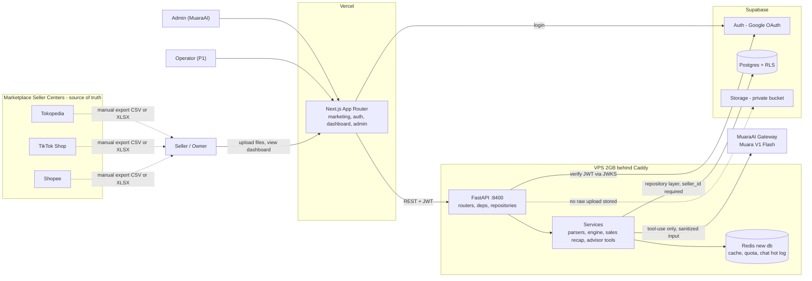

### Fig. 2 — Import flow (critical path)

From file to dashboard. The file is parsed in memory, personal buyer data is dropped before anything is stored, and no raw file exists at rest (ADR-2).

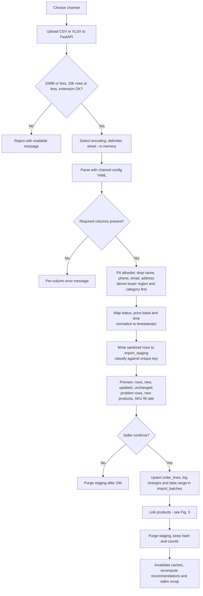

### Fig. 3 — Product matching

Conservative on purpose: a miss stays separate and flagged, which is the safe failure. Order lines are never changed by matching, only the links.

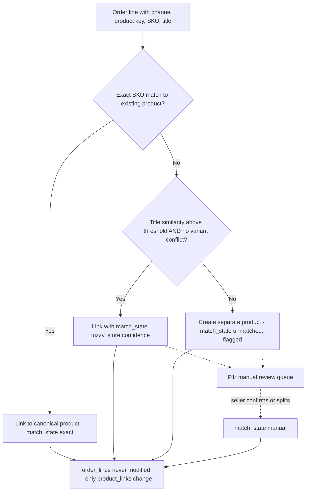

### Fig. 4 — Restock engine decision flow

Evaluation order of the states in section 9A (v3). DEAD is checked first and needs 60 or more days of history. OVERSTOCK is checked before INSUFFICIENT_DATA, so a slow item with a large pile of stock still lands in "stop buying". Quantities use the protection interval P = LT + R. STALE and NEGATIVE are overlays, not states.

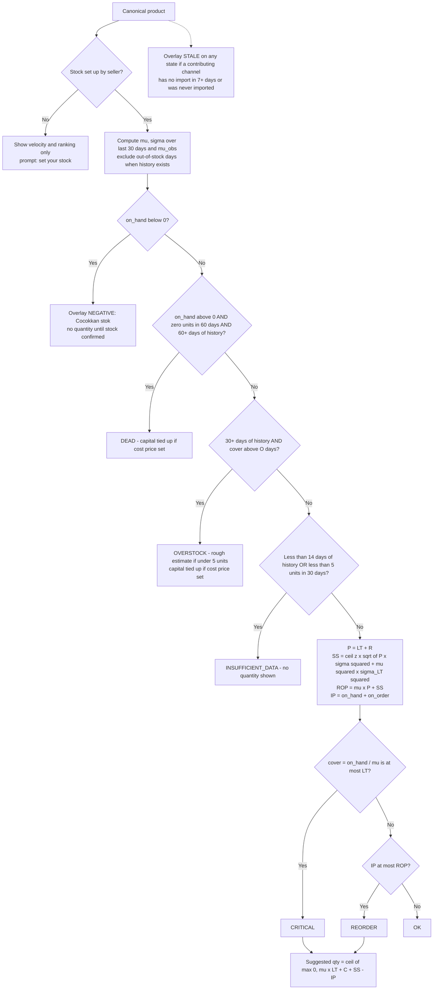

### Fig. 5 — Stock position

How `on_hand` and the inventory position are built. Sales imports reduce stock automatically after the opening date; older sales feed demand only.

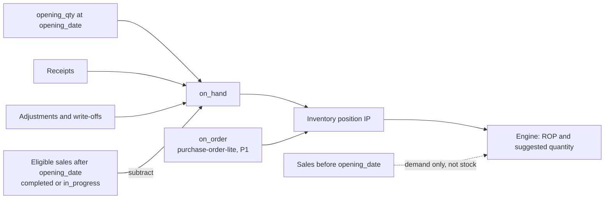

### Fig. 6 — Sales recap metrics

Net sales is derived from uploaded files only, so every number carries its definition and its data coverage. Cancelled and unpaid orders are shown separately and never added to a total.

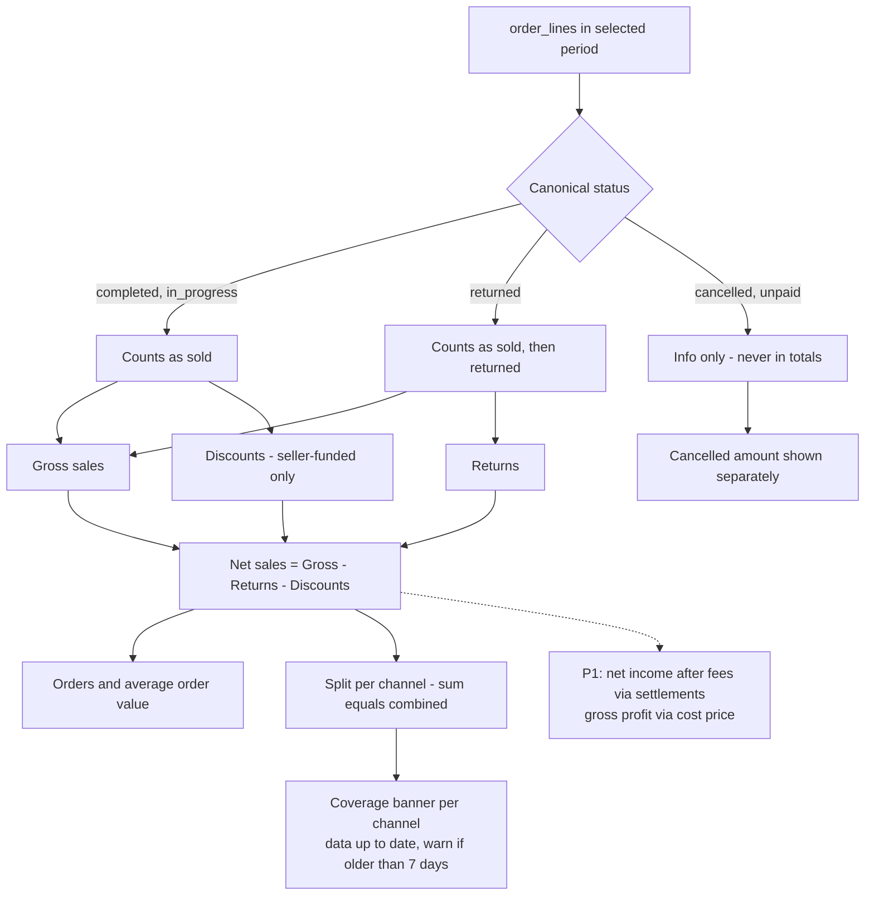

### Fig. 7 — Onboarding journey

First run for a low-tech seller. Stock setup can be skipped, in which case velocity and ranking still work and quantities wait for stock.

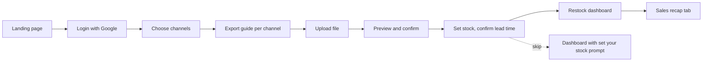

### Fig. 8 — Restock decision flow

The weekly loop between seller and operator. The operator sees the incoming-goods list and never any revenue data.

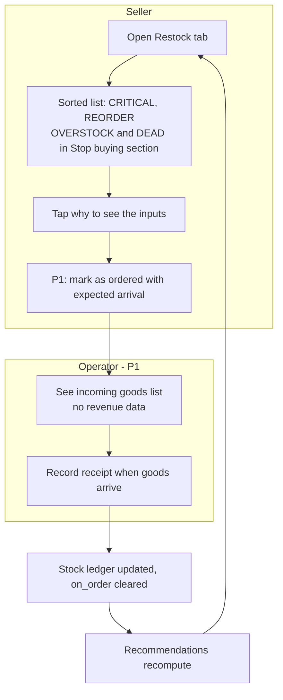

### Fig. 9 — Data model (ERD)

Only key columns are shown. `order_lines` has a unique key on seller_id, channel, order_id and line_key, and holds no personal buyer data.

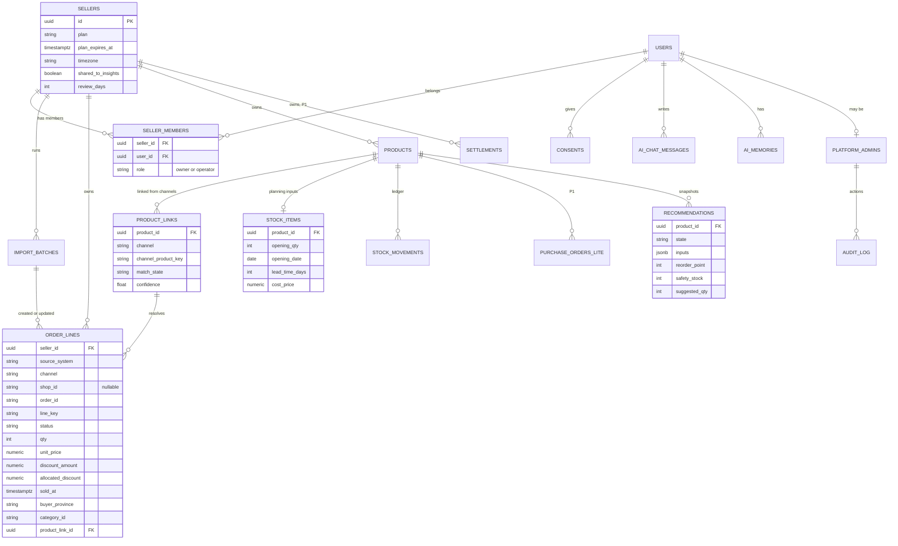

### Fig. 10 — Roles and access

Three roles, enforced on the server. The operator reaches only restock and stock (state, suggested quantity, on-hand; no velocity, cost price or capital), and gets a 403 on any revenue endpoint.

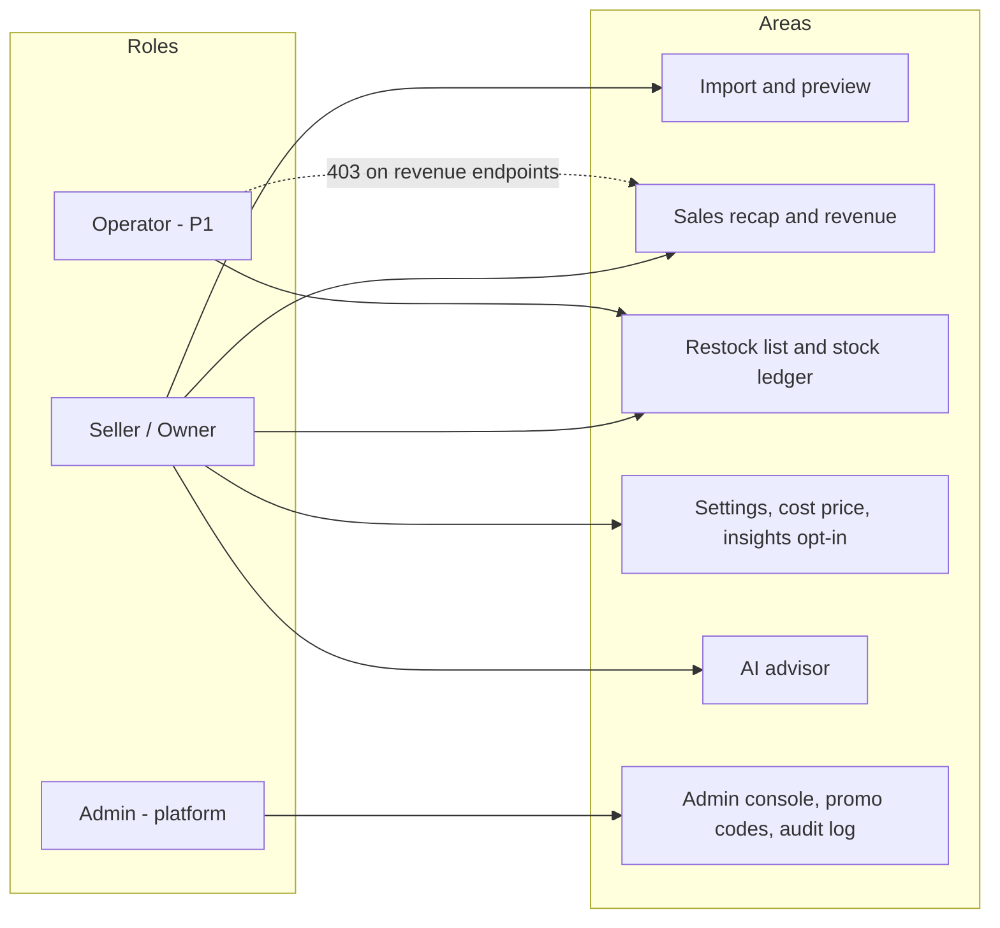

### Fig. 11 — AI advisor request (sequence)

The model picks engine functions and writes the narrative. Numbers come from the tool result and are rendered by the UI as cards, and a numeric check replaces the narrative if it contains a number the tools did not return.

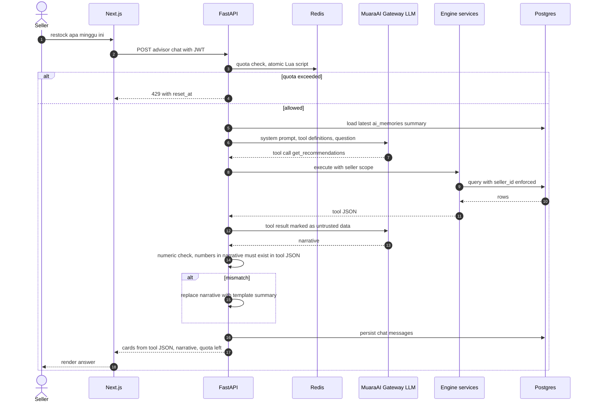

### Fig. 12 — AI memory (redesigned)

Postgres is the source of truth and Redis is only a hot cache, so a session that goes quiet is still summarized the next time the user returns. Summaries hold context and preferences, never numbers.

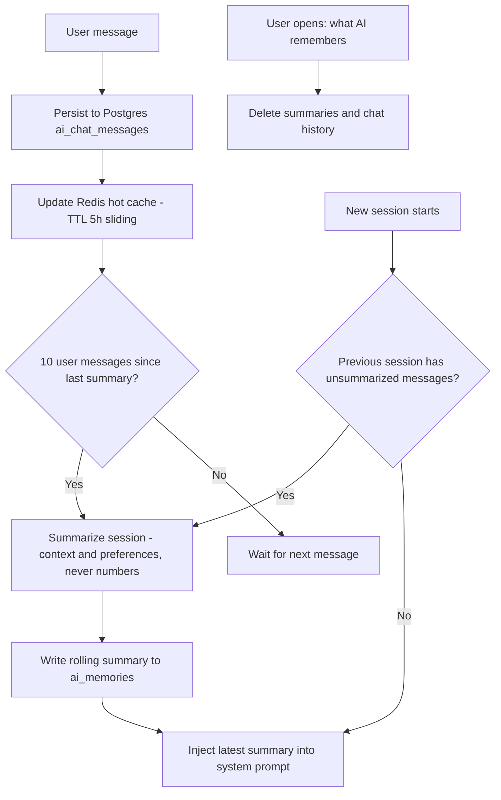

### Fig. 13 — Regional insights publication rule

A region cell is published only if all three checks pass. A failing cell rolls up to its parent level, and a failing province shows no data.

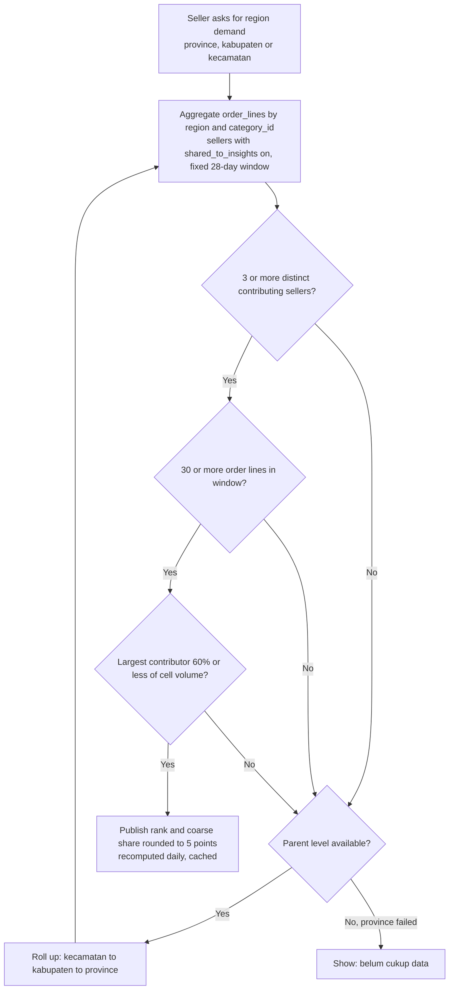

### Fig. 14 — Timeline, 4 to 11 October 2026

All times WIB. Code freeze is Wednesday 7 October at 18:00 and the submission target is Thursday 8 October before noon. Phase B work starts only after submission.

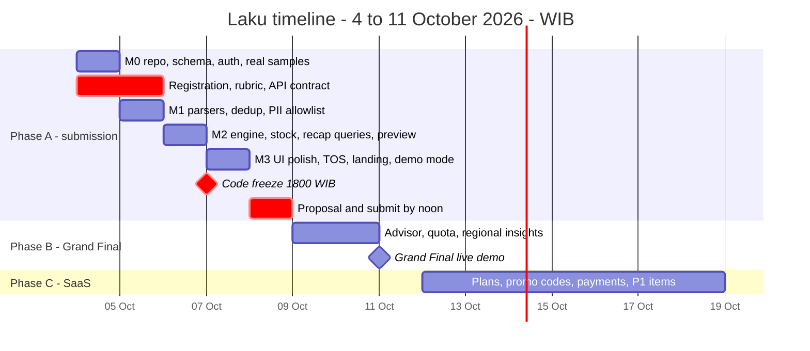

---

*End of PRD v3.1 — APPROVED. Next downstream step: `superpowers:writing-plans` (task list M0–M4). §2.2 assumption tests continue in parallel (Raken, Oct 5–6).*
